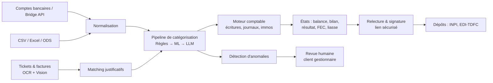

# 01 — Objectifs produit et vision

> Statut : brouillon à valider — Dernière mise à jour : 2026-06-12

## 1. Vision

**AxeLCompta** est une plateforme B2B de production comptable automatisée. Elle ingère
des flux bancaires (API Bridge, fichiers), des justificatifs (tickets, factures), les
catégorise via un pipeline hybride (règles → ML → LLM), produit les livres comptables,
les liasses fiscales et les dépôts légaux, puis fait circuler les documents pour
relecture et signature électronique.

**La plateforme est générique par construction.** Le premier client est une entité
unique (aux activités diverses) qui gère la comptabilité d'environ 200 chauffeurs VTC,
chacun ayant sa propre structure juridique (EURL, SASU…) et donc sa propre
comptabilité, sa propre liasse et ses propres dépôts. Le secteur VTC n'est que le
**premier « pack métier »** (taxonomie, règles, templates d'écritures, modèle ML) ;
d'autres packs s'ajouteront pour d'autres clients sans toucher au cœur.

### Les deux modes d'usage (tous deux supportés par la même plateforme)

| Mode | Qui | Exemple |
|------|-----|---------|
| **Portefeuille** | Une entreprise gère la compta de N autres entreprises | Notre client pilote : 1 gestionnaire → ~200 dossiers chauffeurs indépendants |
| **Mono-entreprise** | Une entreprise gère sa propre compta | Une PME cliente directe (cible plus lointaine) |

Techniquement, un tenant mono-entreprise est un portefeuille de taille 1 : **même
modèle de données, même moteur, seule l'UI s'adapte** (doc 11 §1bis). Aucun des deux
modes ne doit jamais nécessiter de refonte pour activer l'autre.

### Phrase de positionnement

> Un moteur de production comptable fiable et auditable, piloté par des professionnels
> (gestionnaire de portefeuille, expert-comptable, ou l'entreprise pour elle-même),
> invisible pour les bénéficiaires finaux quand ils existent (les chauffeurs), capable
> d'aller de la transaction bancaire brute jusqu'à la télédéclaration — quel que soit
> le statut juridique et le secteur du dossier.

## 2. Ce que la plateforme fait (périmètre)

| # | Capacité | Description |
|---|----------|-------------|
| C1 | **Ingestion bancaire** | Connexion API Bridge (DSP2/AIS) pour récupérer comptes et transactions en continu. |
| C2 | **Ingestion fichiers** | Import CSV, Excel (xlsx/xls), ODS, OFX, QIF — pour les tests, la reprise d'historique et les clients sans API. |
| C3 | **Ingestion justificatifs** | OCR + Vision sur tickets, factures, contrats (LOA, achat véhicule). Le justificatif est un *plus*, jamais un bloqueur : une transaction sans justificatif est traitée quand même, avec un statut « justificatif manquant ». |
| C4 | **Catégorisation hybride** | Règles déterministes codées en dur (faible variance) → modèle ML (entraîné sur 10 ans d'historique) → arbitrage LLM (Claude/Gemini/OpenAI) uniquement sur les cas ambigus, avec données pseudonymisées. |
| C5 | **Détection d'anomalies** | Détection des dépenses suspectes (ex. courses personnelles chez Auchan vs carburant) → signalement « abus de biens sociaux potentiel » pour revue humaine. La plateforme **signale**, elle ne **qualifie jamais juridiquement**. |
| C6 | **Moteur comptable** | Écritures en partie double (PCG), journaux, grand livre, balance, immobilisations et amortissements (achat véhicule), retraitement LOA, TVA, rapprochement bancaire. |
| C7 | **Clôture et états** | Bilan, compte de résultat, annexes, liasse fiscale (2050/2033 selon régime), FEC conforme. |
| C8 | **Dépôts et déclarations** | Génération des fichiers de dépôt des comptes annuels (INPI/greffe via le Guichet Unique), liasses au format EDI-TDFC. Phase 1 : export pour saisie manuelle ou envoi via un partenaire EDI existant. Cible : habilitation Partenaire EDI propre. |
| C9 | **Circuit de validation** | Workflow de relecture → le destinataire (gérant du dossier) reçoit un lien sécurisé pour relire et signer électroniquement les documents. |
| C10 | **Interface B2B adaptative** | Front pour le client gestionnaire et son service compta — et demain pour une entreprise seule. Les gérants des dossiers (chauffeurs) ne voient jamais la plateforme, sauf la page de signature. L'UI s'adapte au mode (portefeuille vs mono) et au statut de chaque dossier. Design sobre et soigné (voir doc 11). |

## 3. Ce que la plateforme ne fait PAS (non-objectifs)

Indispensable pour cadrer le projet et le risque juridique :

- ❌ **Pas de conseil comptable ou fiscal automatisé** présenté comme définitif. Toute
  production est soumise à validation humaine par le client (voir doc 02, arrêt
  Cass. com. 17/09/2025). La plateforme est un **outil**, l'utilisateur professionnel
  reste responsable.
- ❌ **Pas d'interface pour les chauffeurs** (en tout cas pas en V1). Uniquement B2B.
- ❌ **Pas de paie**, pas de social (DSN), pas de juridique (statuts, AG) en V1.
- ❌ **Pas d'accusation automatique** : la détection d'abus produit des *alertes
  à instruire*, jamais des conclusions.
- ❌ **Pas de qualification d'expert-comptable** : on ne signe pas les comptes, on ne
  fait pas de mission de présentation.

## 4. Parties prenantes et personas

| Persona | Rôle | Besoins clés |
|---------|------|--------------|
| **Le client gestionnaire** (mode portefeuille — notre pilote) | Une entité aux activités diverses qui gère la compta de N entreprises tierces | Vue portefeuille, suivi par dossier, validation des catégorisations ambiguës, alertes d'anomalies, gestion des justificatifs manquants, indicateurs de risque. |
| **L'expert-comptable / service compta** | Valide et engage sa responsabilité | Révision rapide, journaux propres, FEC, liasse pré-remplie, piste d'audit complète. |
| **Le gérant du dossier** (chauffeur, dirigeant — utilisateur indirect) | Signe ses documents | Lien simple, lecture claire, signature en 2 clics, aucune création de compte complexe. |
| **L'entreprise autonome** (mode mono-entreprise — futur) | Gère sa propre compta sur la plateforme | Les mêmes capacités, sans la couche portefeuille : une UI directe sur son unique dossier. |
| **AxeL (la SAS)** | Éditeur | Multi-tenant, onboarding d'un nouveau client rapide (nouveau pack métier ou nouveau portefeuille), adaptation ML par client, observabilité. |

## 5. Exigences de versatilité (décision structurante)

Réponse au besoin « ça doit se vendre ailleurs » — c'est une exigence de premier
rang, pas une option :

1. **Multi-statuts juridiques, par dossier, dès le jour 1.** Le statut et le régime
   fiscal sont une **configuration de chaque dossier** : si un chauffeur est en EURL
   et le suivant en SASU, le moteur applique les règles de chacun sans aucune ligne
   de code spécifique. V1 opérationnelle : SASU/EURL à l'IS + SASU/EURL avec option
   IR (marginal chez le pilote mais confirmé). Packs suivants par configuration :
   EI au réel, micro-entreprise, BNC, CAE… (matrice complète : doc 06 §7).
2. **Packs métier** : taxonomie de catégories, règles dures, templates d'écritures
   et adaptation ML sont regroupés par secteur d'activité. Le pack VTC est le
   premier ; un client boulangerie ou BTP = un nouveau pack, pas un nouveau produit.
3. **Deux modes d'usage** : portefeuille (1 → N dossiers) et mono-entreprise
   (1 → 1), même socle, UI adaptée (§1).
4. **Multi-plans de comptes** : PCG de base + plans dérivés par dossier (comptes
   auxiliaires, axe analytique disponible).
5. **Multi-formats d'entrée** : tout format tabulaire raisonnable doit pouvoir être
   mappé via un *profil d'import* configurable par client.
6. **ML hiérarchique à 3 niveaux** : un socle global (catégorisation), une
   adaptation par client/pack métier, et un **profil comportemental individuel par
   dossier** (les habitudes de CE chauffeur) pour la détection d'anomalies — sans
   entraîner 200 modèles séparés (doc 07 §3.3).
7. **Sortie multi-canal** : mêmes données → export PDF, FEC, EDI-TDFC, CSV, API.

## 6. Critères de succès (KPIs)

| KPI | Cible V1 | Cible mature |
|-----|----------|--------------|
| Taux de catégorisation automatique (sans revue humaine) | ≥ 85 % | ≥ 95 % |
| Précision de catégorisation (sur jeu de validation) | ≥ 97 % | ≥ 99 % |
| Transactions traitées par les règles dures (déterministe) | ≥ 60 % | ≥ 70 % |
| Recours au LLM (coût + latence) | ≤ 10 % des transactions | ≤ 3 % |
| Rappel de la détection d'anomalies (abus détectés / abus réels) | ≥ 80 % | ≥ 95 % |
| Balance déséquilibrée en production | **0, toujours** (invariant) | 0 |
| FEC rejeté par le test DGFiP (outil « Test Compta Demat ») | 0 | 0 |
| Délai transaction → écriture validée | < 48 h | < 4 h |
| Disponibilité plateforme | 99,5 % | 99,9 % |

## 7. Hypothèses et risques majeurs

| Risque | Impact | Mitigation |
|--------|--------|------------|
| Frontière juridique de l'activité (ordonnance de 1945) | Existentiel | Positionnement éditeur strict + validation humaine obligatoire dans le workflow (doc 02). |
| Qualité des données d'entraînement (10 ans d'historique) | Élevé | Audit du dataset avant tout entraînement, nettoyage documenté (doc 07). |
| Dépendance Bridge (pricing, API) | Moyen | Couche d'abstraction `BankProvider`, formats fichiers comme fallback permanent. |
| Habilitation Partenaire EDI longue à obtenir | Moyen | Stratégie en 3 temps : manuel → partenaire EDI tiers → habilitation propre (doc 02 §5). |
| 1-2 devs seulement | Élevé | Périmètre V1 strict, qualité de code et tests non négociables (docs 08-09), pas de microservices. |
| Réforme facturation électronique 09/2026 | Moyen | Veille active ; en réception nous consommons du Factur-X, opportunité plus que menace (doc 02 §7). |

## 8. Vue d'ensemble du flux

## 9. Questions ouvertes à trancher avec le client

- [x] ~~Structure du client pilote~~ → confirmé : 1 entité gestionnaire → ~200 dossiers indépendants, chacun avec son statut, ses comptes et sa liasse.
- [x] ~~Statuts juridiques~~ → confirmé : mix SASU/EURL à l'IS + quelques-unes avec option IR (bornée 5 exercices, doc 06 §7). Reste à collecter la **liste exacte statut par chauffeur** à l'onboarding — chaque dossier est paramétré individuellement.
- [x] ~~Régime TVA~~ → confirmé : les chauffeurs du pilote sont normalement tous au **réel** ; la franchise doit être supportée aussi. Les deux dans la V1, réel testé en priorité.
- [ ] Qui valide en dernier ressort chaque dossier : le service compta du client gestionnaire, ou un cabinet comptable partenaire ?
- [ ] Le client a-t-il déjà un contrat Bridge ou faut-il le souscrire (et qui paie) ?
- [ ] Les 10 ans de données : sous quel format, quelle qualité, quel droit d'usage RGPD pour l'entraînement ?
- [ ] Quel prestataire de signature électronique le client accepte-t-il (Yousign, Docusign, autre) ?
- [ ] SLA attendu par le client, et exigences de son service sécurité (questionnaire fournisseur probable).
