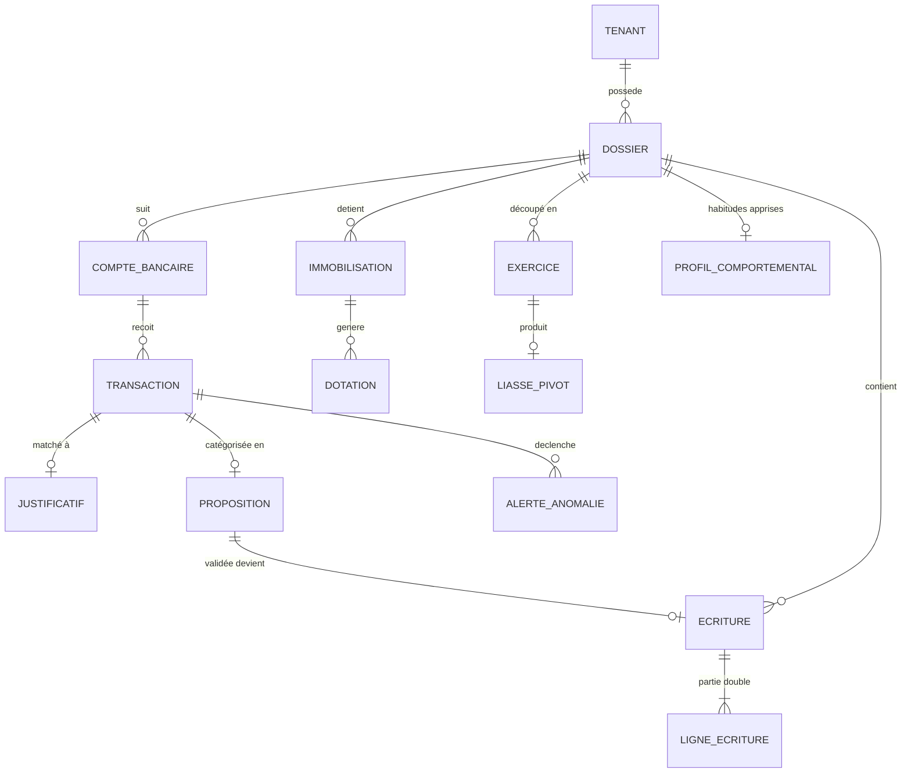
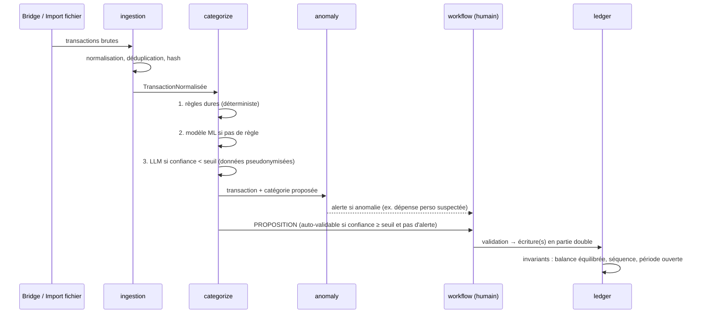

# 03 — Architecture technique

> Statut : brouillon à valider — Dernière mise à jour : 2026-06-12

## 1. Principes directeurs

Calibrés pour une équipe de 1-2 devs visant une fiabilité « comptable » :

1. **Monolithe modulaire, pas de microservices.** Un seul déploiement backend, mais
   des modules internes aux frontières strictes (imports contrôlés, interfaces
   explicites). Les microservices se justifieront peut-être un jour ; à 2 devs ils
   sont un piège opérationnel.
2. **Le cœur comptable est déterministe et pur.** Aucune I/O, aucun appel réseau,
   aucune dépendance ML dans le module `ledger`. Entrées → sorties reproductibles.
   C'est ce qui rend le système testable façon « NASA » (doc 08).
3. **Le ML et les LLM sont à la périphérie, jamais au centre.** Ils *proposent*,
   le cœur *dispose*. Une panne d'OpenAI ne doit jamais empêcher de clôturer un
   exercice.
4. **Event-sourcing léger sur les faits comptables.** Les écritures sont immuables
   (append-only) ; les corrections sont des contre-passations. La piste d'audit est
   un sous-produit gratuit de ce choix.
5. **Multi-tenant dès le jour 1.** Isolation par `tenant_id` partout, vérifiée par
   des tests et par Row Level Security en base.
6. **Un tenant = un portefeuille de 1 à N dossiers.** Le mode « gestionnaire »
   (notre pilote : ~200 dossiers) et le mode « mono-entreprise » (futur : 1 dossier)
   sont le **même modèle de données et le même moteur** ; seule l'UI diffère
   (doc 11 §1bis). Aucune table, aucun service ne suppose N > 1 ni N = 1.
7. **Le comportement métier est de la configuration, pas du code.** Statut
   juridique et régime fiscal sont des attributs du dossier ; taxonomies, règles,
   templates d'écritures sont des **packs métier** versionnés en données (§3bis).
   Ajouter un statut ou un secteur ne crée pas de branche dans le code.
8. **Tout fichier reçu est conservé tel quel** (immutable, horodaté, hashé) avant
   tout parsing. On peut toujours rejouer un import.

## 2. Stack retenue

| Couche | Choix | Justification |
|--------|-------|---------------|
| Backend API | **Python 3.12+ / FastAPI** | Écosystème ML/OCR, typage fort (mypy strict), async pour les I/O Bridge. |
| Validation | **Pydantic v2** | Contrats de données stricts à toutes les frontières. |
| ORM / migrations | **SQLAlchemy 2 + Alembic** | Standard, migrations versionnées et révisables. |
| Base de données | **PostgreSQL 16** | Transactions ACID (non négociable en compta), RLS pour le multi-tenant, JSONB pour les payloads bruts. |
| File d'attente / jobs | **PostgreSQL (SKIP LOCKED) ou Redis + RQ** | Commencer simple : une table de jobs en Postgres suffit largement à 200 dossiers. |
| Stockage objets | **S3-compatible (OVH Object Storage / DO Spaces)** | Justificatifs, exports, datasets. Versioning + verrouillage WORM pour l'archivage légal. |
| ML | **scikit-learn (+ XGBoost/LightGBM)** | Tabulaire + texte court = gradient boosting et TF-IDF font très bien le travail. Pas de deep learning tant que pas nécessaire (doc 07). |
| OCR / Vision | Voir doc 04 §4 | Hybride : extraction native PDF → OCR open-source → Vision LLM en fallback. |
| LLM | **Abstraction `LLMProvider`** (Claude / Gemini / OpenAI interchangeables) | Pas de couplage à un fournisseur ; pseudonymisation en amont (doc 10). |
| Frontend | **TypeScript / React / Next.js** | SSR pour les pages de signature publiques, app riche pour le back-office. |
| UI kit | Voir doc 11 | Design system maison léger sur base Radix/shadcn. |
| Infra | **OVH ou DigitalOcean** — décision en phase 1 | Critères §8. Docker Compose au début, pas de Kubernetes. |
| CI/CD | **GitHub Actions** | Lint, typecheck, tests, conformité FEC, build, déploiement. |
| Observabilité | **Sentry + logs structurés JSON + métriques Prometheus** | Erreurs, latence pipeline, taux de catégorisation en continu. |

## 3. Découpage en modules (monolithe modulaire)

```text
axelcompta/
├── core/            # Types partagés, Result, erreurs, monnaie (int centimes), dates
├── tenants/         # Tenants (mode portefeuille ou mono), dossiers, statuts/régimes
├── packs/           # Packs métier : taxonomies, règles système, templates, config plateformes
├── ingestion/       # Orchestration de l'ingestion ; sous-modules :
│   └── providers/   #   DataProvider ABC + implémentations (Bridge, Rollee, FileImport)
├── documents/       # Justificatifs : stockage, OCR, Factur-X, matching transactions
├── categorize/      # Pipeline hybride : règles → ML → LLM → revue humaine
├── anomaly/         # Détection d'abus / anomalies, scoring, alertes
├── ledger/          # ❤️ Moteur comptable PUR : écritures, journaux, balance, immos, TVA
├── closing/         # Clôture d'exercice, états financiers, liasse (modèle pivot)
├── filings/         # Renderers : FEC, PDF, EDI-TDFC, dossier INPI
├── workflow/        # Validation, circuit de relecture, signature électronique
├── api/             # Routes FastAPI, auth, permissions (aucune logique métier)
└── ml/              # Entraînement, évaluation, registry de modèles (hors runtime API)
```

**Pattern DataProvider (ingestion/providers/) :** toute source de données d'entrée implémente l'interface `DataProvider`. La configuration du tenant détermine quels providers sont actifs — le code métier ne connaît pas le provider. Providers V1 : `BridgeProvider` (transactions bancaires), `RolleeProvider` (settlements plateformes gig), `FileImportProvider` (CSV/XLSX/ODS). Détails : doc 13.

**Règles de dépendance** (vérifiées par import-linter en CI) :

- `ledger` ne dépend de rien sauf `core`. Jamais de `categorize`, `ml`, `api`.
- `categorize` produit des `ProposedEntry`, seul `workflow` peut les transformer en
  écritures via `ledger` après validation.
- `api` n'importe que les façades publiques de chaque module (`module/service.py`).
- Personne n'importe `ml` au runtime : les modèles sont chargés comme artefacts.

## 3bis. Les deux axes de configuration : statut du dossier × pack métier

Chaque **dossier** est indépendant et porte sa configuration complète en propre —
le tenant ne fournit que des valeurs de pré-remplissage à la création, jamais
d'héritage implicite (doc 06 §7). Deux configurations orthogonales, lues par tout
le système :

1. **Profil juridique et fiscal** (`statut`) : forme (SASU, EURL, EI…), régime
   d'imposition (IS, ou option IR — bornée à 5 exercices, avec date de fin et
   bascule tracée), régime TVA (réel simplifié/normal en V1, franchise supportée),
   obligations de dépôt. Détermine les formulaires de liasse, le traitement de la
   rémunération du dirigeant, le compte utilisé en cas d'usage personnel (455 vs
   108), le dépôt INPI ou non.
   → Matrice complète et régimes opérationnels V1 : doc 06 §7.
2. **Pack métier** (`secteur`) : taxonomie de catégories, règles système, templates
   d'écritures sectoriels, paramètres de détection d'anomalies, adaptation ML.
   Le pack **VTC** est le premier ; un pack est un ensemble de données versionnées
   (+ ses tests), pas du code.

Exemple : deux chauffeurs du même client → même pack `vtc`, mais l'un en
`EURL option IR` et l'autre en `SASU IS` produisent des liasses différentes.
Inversement, une SASU de boulangerie partagerait le statut du second avec un autre
pack. **Aucun `if secteur == "vtc"` ni `if forme == "SASU"` hors de ces deux
modules de configuration.**

## 4. Modèle de données (vue logique simplifiée)



Points structurants :

- **`TRANSACTION` (fait brut) ≠ `ECRITURE` (fait comptable).** La transaction
  bancaire est conservée brute et immuable ; l'écriture est sa traduction comptable
  validée. Lien 1-n possible (une transaction → écriture composée TTC/HT/TVA).
- **`PROPOSITION`** porte : catégorie proposée, source (`RULE | ML | LLM | HUMAN`),
  score de confiance, features d'explication. Historisée même après validation
  (données d'entraînement futures + audit).
- **Montants en centimes (entiers), jamais en flottants.** Type `Money` dans `core`.
- **`LIASSE_PIVOT`** : représentation interne case-par-case des formulaires (cf.
  doc 02 §5), sérialisée en JSONB, versionnée par millésime fiscal. Les formulaires
  inclus dépendent du statut du dossier (2065+2050-suite en IS, 2031+annexes en IR…).
- **`PROFIL_COMPORTEMENTAL`** : statistiques apprises par dossier (conso carburant
  habituelle, enseignes récurrentes, montants types) recalculées incrémentalement,
  utilisées par `anomaly` (doc 07 §3.3). Ce n'est pas un modèle ML par dossier,
  c'est une fiche de stats — peu coûteux, recalculable à volonté.

## 5. Flux d'une transaction (chemin nominal)



Règle d'or : **une proposition à haute confiance issue des règles dures peut être
auto-validée par configuration du tenant ; tout ce qui vient du LLM ou porte une
alerte passe par un humain.**

## 6. Frontières et contrats

Chaque frontière du système a un contrat Pydantic versionné :

| Frontière | Contrat | Notes |
|-----------|---------|-------|
| Bridge → ingestion | `BridgeTransaction` | Payload brut archivé en JSONB avant mapping. |
| Fichier → ingestion | `ImportProfile` + `RawRow` | Profil de mapping par client (colonnes, formats de date, séparateurs). |
| ingestion → categorize | `NormalizedTransaction` | Libellé nettoyé, montant signé en centimes, devise, dates, compteur de doublons. |
| categorize → workflow | `CategorizationProposal` | Catégorie, compte PCG cible, confiance ∈ [0,1], source, explication. |
| workflow → ledger | `JournalEntryDraft` | Validé par qui, quand ; le ledger re-vérifie tous les invariants (défense en profondeur). |
| closing → filings | `LiassePivot` | Indépendant du format de sortie. |
| * → LLM | `PseudonymizedPrompt` | Construit uniquement via le module de pseudonymisation (doc 10 §4). |

## 7. Auth, rôles, multi-tenant

- **Utilisateurs B2B** : auth par email + MFA obligatoire (TOTP/WebAuthn). SSO
  (SAML/OIDC) en phase 2 si la banque l'exige.
- **Rôles V1** : `admin_tenant`, `comptable` (valide), `analyste` (lit, annote),
  `signataire_externe` (accès par lien magique scoped à un paquet de documents,
  expirable, sans compte).
- **Isolation** : `tenant_id` obligatoire sur toutes les tables métier + RLS
  PostgreSQL activée + tests d'isolation automatisés (doc 09 §6).
- **Liens de signature** : URL signées à usage limité, expiration courte,
  journalisation de chaque consultation (qui a ouvert quoi, quand — utile en cas de
  litige sur « j'ai signé sans voir »).

## 8. Choix d'hébergement OVH vs DigitalOcean

| Critère | OVHcloud | DigitalOcean |
|---------|----------|--------------|
| Localisation données (exigence banque) | ✅ France, SecNumCloud possible | ⚠️ UE possible (AMS/FRA) mais société US (CLOUD Act) |
| Postgres managé | ✅ | ✅ |
| Object Storage S3 | ✅ | ✅ (Spaces) |
| Perception par une banque française | ✅ Fort argument | ⚠️ Friction probable |
| DX / simplicité | Moyenne | Très bonne |

**Recommandation** : DigitalOcean acceptable pour les environnements de dev/staging ;
**production chez OVH** (argument commercial décisif face à une banque + CLOUD Act).
Décision à confirmer après le questionnaire sécurité du client.

## 9. Environnements et déploiement

- `dev` (local, Docker Compose : Postgres + MinIO + backend + front).
- `staging` (données synthétiques ou pseudonymisées **uniquement** — jamais de vraies
  données bancaires hors prod).
- `prod` (OVH, sauvegardes Postgres PITR, restauration testée trimestriellement).
- Déploiement : image Docker unique backend + front statique/SSR. Migrations Alembic
  exécutées en étape dédiée avec verrou. Rollback = image précédente + migrations
  down testées.

## 10. Décisions d'architecture à confirmer (ADR à écrire)

Tenir un dossier `docs/adr/` (Architecture Decision Records, 1 page par décision) :

- [ ] ADR-001 : monolithe modulaire (ce document) — à acter.
- [ ] ADR-002 : Postgres comme file de jobs vs Redis — trancher au premier besoin réel.
- [ ] ADR-003 : hébergement prod OVH — après questionnaire sécurité banque.
- [ ] ADR-004 : prestataire signature électronique (Yousign pressenti : français, API propre, eIDAS) .
- [ ] ADR-005 : moteur OCR retenu après benchmark (doc 04 §4).
- [ ] ADR-006 : bibliothèque de génération PDF des liasses (rendu fidèle aux CERFA).
