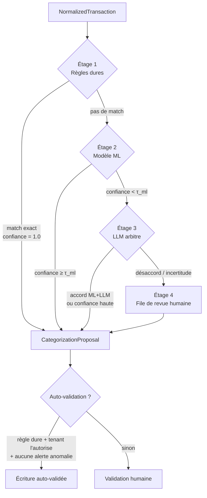

# 05 — Pipeline de catégorisation hybride et détection d'anomalies

> Statut : brouillon à valider — Dernière mise à jour : 2026-06-12

C'est le cœur « intelligent » du système, conçu exactement comme exprimé dans le
besoin initial : **rigide d'abord** (règles codées en dur, variance nulle), **ML
ensuite** (généralisation), **LLM en dernier** (arbitrage des cas ambigus), **humain
toujours en bout de chaîne** pour ce qui compte.

## 1. Architecture en étages



Objectifs chiffrés par étage (cf. KPIs doc 01) : règles ≥ 60 % des transactions,
ML ~30 %, LLM ≤ 10 %, revue humaine ce qui reste. Le coût et la variance augmentent
à chaque étage ; le volume doit diminuer.

## 2. Étage 1 — Règles dures (déterministe, biais maîtrisé)

### 2.1 Nature des règles

Des règles **déclaratives, versionnées en base, testables**, à trois niveaux de
priorité :

1. **Règles système** : enseignes nationales sans ambiguïté, livrées par **pack
   métier** (doc 03 §3bis) — le pack VTC fournit p. ex. `libellé contient
   "TOTALENERGIES|ESSO|BP STATION" → 6061 carburant (TVA récup. partielle selon
   véhicule)` ; un futur pack restauration ou BTP aura les siennes.
2. **Règles tenant** : spécificités du client. Ex. sa commission de gestion,
   le loyer LOA prélevé par tel organisme → `6122 redevances crédit-bail`.
3. **Règles dossier** : apprises des corrections. Quand un humain corrige 3 fois le
   même couple (créancier, catégorie) sur un dossier, le système **propose** de
   créer une règle (jamais silencieusement).

### 2.2 Anatomie d'une règle

```yaml
id: rule-fuel-total-001
priorite: 100
porte: systeme
conditions:
  libelle_regex: '(?i)\b(TOTAL\s?ENERGIES|RELAIS\s)\b'
  montant: { min: -30000, max: -200 }       # centimes : 2 € à 300 € débit
  sens: debit
action:
  categorie: carburant
  compte_pcg: "60611"
  tva: { taux: 20, recuperation: "selon_vehicule" }  # résolue par le paramétrage dossier
  confiance: 1.0
tests:                                       # chaque règle embarque ses cas de test
  doit_matcher: ["CB TOTALENERGIES PARIS 15", "RELAIS TOTAL A6"]
  ne_doit_pas_matcher: ["TOTAL LOOK COIFFURE"]   # 😉 les pièges réels
```

**Toute règle a des cas de test embarqués, exécutés en CI.** Une règle sans test ne
peut pas être activée. Les collisions entre règles (deux règles matchent) sont
résolues par priorité et **journalisées** pour révision.

### 2.3 Pourquoi cet étage est premier

Variance nulle, explicabilité parfaite (« la règle X a matché »), coût zéro,
auditabilité totale — exactement ce qu'un contrôleur ou une banque veut entendre.
Tout investissement qui déplace du volume du ML vers les règles est rentable.

## 3. Étage 2 — Modèle ML

Détails d'entraînement dans doc 07. Ici, le contrat d'intégration :

- **Entrée** : features dérivées de `NormalizedTransaction` (texte du libellé
  nettoyé, montant, jour de semaine, récurrence détectée, MCC si fourni par Bridge,
  catégorie Bridge si fournie — *feature*, pas vérité).
- **Sortie** : distribution de probabilités sur la **taxonomie du pack métier du
  dossier** (le pack VTC : ~40-80 classes — carburant, péage, lavage, entretien,
  assurance, LOA, commissions plateformes, téléphone, repas, parking…), chaque
  catégorie étant mappée vers un compte PCG par le paramétrage du dossier (le
  compte final peut différer selon le statut/régime du dossier).
- **Seuil τ_ml par classe, pas global** : on exige plus de confiance pour les
  classes à enjeu (immobilisations, rémunérations) que pour un péage.
- **Calibration obligatoire** (Platt/isotonic) : un score de 0,9 doit vouloir dire
  90 % de chances d'avoir raison, sinon les seuils ne signifient rien.
- Le modèle est un **artefact versionné** (registry, doc 07 §6) chargé au démarrage.
  Pas d'entraînement dans le runtime API, jamais.

## 4. Étage 3 — LLM arbitre

- **Quand** : confiance ML < τ_ml, ou catégorie à enjeu, ou libellé jamais vu.
- **Quoi** : prompt structuré contenant le libellé **pseudonymisé** (doc 10 §4), le
  montant, le contexte métier issu du pack du dossier (« chauffeur VTC », demain
  « boulangerie »…), le top-3 du ML avec ses scores, la taxonomie autorisée, et les
  données du justificatif matché s'il existe.
- **Sortie contrainte** : JSON schema strict — `{categorie ∈ taxonomie, confiance,
  justification_courte}`. Toute sortie hors schéma = rejet → revue humaine. Le LLM
  ne peut **pas** inventer de catégorie.
- **Politique de décision** :
  - LLM et ML d'accord → proposition avec confiance renforcée.
  - Désaccord → revue humaine, avec les deux avis affichés.
  - Le LLM seul ne suffit jamais à auto-valider.
- **Abstraction multi-fournisseurs** (`LLMProvider`) : Claude / Gemini / OpenAI
  interchangeables, fallback en cas de panne, budget par tenant, cache des réponses
  par libellé-type (un même libellé récurrent ne paie qu'un appel).
- **Boucle d'amélioration** : chaque cas envoyé au LLM est un signal que règles et
  ML ont une lacune. Revue mensuelle des motifs d'escalade → nouvelles règles ou
  réentraînement.

## 5. Étage 4 — Revue humaine

- File de travail priorisée : alertes d'abus > catégories à enjeu > gros montants >
  reste. Temps de décision visé < 10 s par item (UI, doc 11).
- **Chaque correction humaine est de l'or** : stockée comme label
  (`PROPOSITION.source = HUMAN`), elle alimente le réentraînement et le minage de
  règles. C'est la boucle de fine-tuning par client demandée.

## 6. Détection d'anomalies et d'abus (module `anomaly`)

### 6.1 Posture

Le module **signale des incohérences**, l'humain qualifie. Aucune sortie du système
n'emploie de qualification juridique (« abus de biens sociaux ») ; vocabulaire UI :
« dépense à justifier », « dépense atypique », « usage personnel possible ».

### 6.2 Le profil comportemental individuel (la clé du « chaque dossier a son analyse »)

Chaque dossier porte un **profil comportemental** appris automatiquement de son
propre historique : consommation habituelle par catégorie (moyenne, dispersion,
saisonnalité), enseignes récurrentes, montants types, fréquences. C'est une fiche
de statistiques recalculée incrémentalement — pas un modèle entraîné par dossier —
donc ça passe à l'échelle sur 200 ou 2 000 dossiers sans coût notable (doc 07 §3.3).

C'est ce profil qui permet de capter « ce chauffeur a consommé plus que d'habitude
cette fois-ci » : la détection compare chaque transaction aux habitudes de **ce**
dossier, pas à une moyenne globale. Les seuils et catégories surveillées viennent
du pack métier (le pack VTC surveille carburant/entretien ; un autre pack
surveillera d'autres postes).

### 6.2bis Détecteurs (du plus simple au plus riche)

| Détecteur | Type | Exemple capté |
|-----------|------|---------------|
| Catégorie intrinsèquement personnelle | Règle (pack) | Vétérinaire, jouets, abonnement streaming personnel sur le compte pro. |
| Enseigne ambiguë + montant/ticket incohérent | Règle + OCR | Auchan 87 € sans ticket carburant, ou ticket listant des courses alimentaires. |
| Écart au profil comportemental du dossier | Stats (§6.2) | Dépense carburant 3σ au-dessus de l'habitude de CE chauffeur ; plein d'essence 2× le même jour. |
| Cohérence métier (règles du pack) | Règle métier | Pack VTC : carburant sans activité de courses sur la période ; péages un jour sans recettes. |
| Doublons de remboursement | Règle | Même justificatif matché sur deux transactions. |
| Comparaison aux pairs du portefeuille | ML (phase 2) | Ratio entretien/CA très au-dessus des dossiers comparables du même pack. |
| Week-end/horaires (prudent) | Stats (phase 2) | Signal faible seulement — pondéré par le profil du dossier (les VTC travaillent le week-end), jamais utilisé seul. |

### 6.3 Cycle de vie d'une alerte

`ouverte → en instruction → justifiée (avec pièce/commentaire) | confirmée usage
personnel → traitement comptable (455 ou 108 selon le statut configuré du dossier,
doc 06 §7) | faux positif (→ label d'entraînement)`.

Tout est journalisé : qui a instruit, décision, pièces. C'est la valeur ajoutée
pour le client gestionnaire (conformité) et une donnée d'entraînement pour
améliorer la précision des détecteurs.

### 6.4 Mesure

Le rappel (ne pas rater de vrais abus) prime sur la précision à volume d'alertes
soutenable : cible V1 = rappel ≥ 80 % avec ≤ 5 % des transactions alertées.
Jeu d'évaluation : abus historiques connus du client + abus synthétiques injectés.

## 7. Explicabilité de bout en bout

Pour chaque écriture finale, on doit pouvoir afficher (et exporter pour un audit) :

> Transaction `CB AUCHAN CARBURANT 12/03` −67,40 € → catégorie **carburant** par
> **règle systeme rule-fuel-auchan-002 (v3)**, ticket matché #4521 (confiance 0,97),
> TVA récupérée 80 % (véhicule de tourisme, paramétrage dossier), validée par
> M. Dupont le 14/03/2026, écriture n° 2026-AC-00871.

Cette traçabilité est un invariant produit : aucune étape du pipeline ne peut
produire une proposition sans renseigner sa source, sa version et ses entrées.
