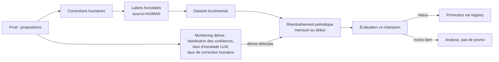

# 07 — ML : données, entraînement, évaluation, MLOps

> Statut : brouillon à valider — Dernière mise à jour : 2026-06-12

## 1. Philosophie

Le ML est l'étage 2 du pipeline (doc 05). Il doit être **simple, calibré,
explicable, remplaçable**. La performance du système ne repose pas sur un modèle
brillant mais sur la qualité du dataset, du nettoyage des libellés et de la boucle
de feedback humain. À budget de 1-2 devs : pas de deep learning tant que les
baselines ne sont pas saturées.

## 2. Le dataset : 10 ans d'historique client

C'est l'actif le plus précieux du projet — et le chantier le plus sous-estimé.

### 2.1 Audit avant tout entraînement (livrable : rapport de qualité dataset)

- [ ] Inventaire : formats (export logiciel compta ? FEC ? Excel ?), périodes
      couvertes, nombre de dossiers et de lignes, droit d'usage RGPD (doc 02 §8).
- [ ] Le champ clé existe-t-il : **libellé bancaire brut** ↔ **compte PCG imputé** ?
      ⚠️ Risque n° 1 : un historique de FEC contient les écritures mais pas toujours
      les libellés bancaires d'origine. Si le lien transaction → imputation est
      perdu, le dataset vaut beaucoup moins — à vérifier en priorité absolue.
- [ ] Qualité des labels : imputations faites par qui ? Un comptable rigoureux ou
      des stagiaires pressés ? Échantillonner 500 lignes et faire relire.
- [ ] Dérive temporelle : enseignes disparues, changements de PCG, pratiques
      d'imputation qui ont évolué → pondérer les années récentes.
- [ ] Distribution des classes : déséquilibre attendu (énormément de carburant/péage,
      très peu d'immobilisations) → stratégie par classe (§4).

### 2.2 Constitution

- **Unité d'exemple** : (libellé brut, montant, méta) → catégorie de la taxonomie.
- **Mapping comptes historiques → taxonomie** : table de correspondance revue à la
  main (les plans de comptes historiques différeront du nôtre).
- **Pseudonymisation du dataset** : noms/IBAN remplacés par des tokens stables
  (`{PERSONNE_1}`) — le modèle n'a pas besoin des identités, et ça sécurise le RGPD.
- **Splits** : train / validation / test **par dossier ET par période** (les
  transactions d'un même chauffeur se ressemblent : un split aléatoire ligne à ligne
  surestimerait grossièrement la performance — fuite de données classique).

## 3. Features et modèle

### 3.1 Features V1

| Feature | Type | Note |
|---------|------|------|
| Libellé nettoyé : TF-IDF mots + n-grammes de caractères (3-5) | texte | Les n-grammes de caractères encaissent les troncatures bancaires (`CARREFOUR MKT`, `CARREF`). |
| Montant (log-bucketé) + signe | num | |
| Jour de semaine, jour du mois | cat | Loyers et prélèvements sont périodiques. |
| Récurrence : même libellé-type déjà vu sur le dossier, périodicité détectée | num | Feature très puissante. |
| MCC / catégorie Bridge si disponibles | cat | En entrée du modèle, pas en vérité terrain. |
| Présence et contenu du justificatif matché (type de commerce OCR) | cat | |

### 3.2 Modèles, dans l'ordre

1. **Baseline obligatoire** : régression logistique sur TF-IDF. Simple, rapide,
   explicable. C'est la barre à battre — et elle est souvent dure à battre sur du
   libellé bancaire.
2. **Challenger V1** : LightGBM/XGBoost sur features mixtes texte+numérique.
3. **Plus tard seulement, si gain prouvé** : embeddings de phrases + classifieur,
   ou fine-tuning d'un petit modèle type CamemBERT. Coût/complexité à justifier
   par une amélioration mesurée sur le jeu de test.

**Calibration systématique** (isotonic sur le set de validation) : les seuils
d'auto-validation du pipeline n'ont de sens que si les probabilités sont honnêtes.

### 3.3 La hiérarchie à 3 niveaux : global → client → dossier

C'est l'architecture qui répond au double besoin « versatile entre clients » ET
« chaque chauffeur a son analyse fine », sans exploser les coûts d'entraînement.

**Niveau 1 — Socle global (catégorisation)** : un modèle entraîné sur tout
l'historique inter-clients pseudonymisé. C'est lui qui sait que `RELAIS TOTAL A6`
est du carburant. Réentraîné périodiquement, pas en continu.

**Niveau 2 — Adaptation par client / pack métier** : trois mécanismes, du moins
cher au plus cher :
  1. Règles tenant (doc 05 §2) — couvrent l'essentiel des spécificités locales.
  2. **Réentraînement du socle + données du tenant sur-pondérées** : simple,
     robuste, suffisant à notre échelle (pas besoin de vrai « fine-tuning » au sens
     deep learning).
  3. Modèle dédié au pack/tenant si le domaine est vraiment différent (futur client
     hors VTC) — l'architecture registry (§6) le permet sans changer le code.

**Niveau 3 — Profil comportemental par dossier (anomalies)** : chaque dossier
(chaque chauffeur) a une **fiche statistique individuelle** apprise de son propre
historique : consommation habituelle par catégorie, dispersion, enseignes et
montants types, saisonnalité. C'est elle qui capte « ce chauffeur a consommé plus
que d'habitude » (doc 05 §6.2). Point clé de performance : ce ne sont **pas 200
modèles entraînés** — ce sont des agrégats incrémentaux (moyennes/quantiles mis à
jour à chaque transaction), coût quasi nul, recalculables from scratch en minutes,
et ça vaut pour 200 comme pour 10 000 dossiers.

**Budget de calcul maîtrisé** (« ne pas passer 10 ans à entraîner sur 10 ans de
data ») : les modèles V1 (TF-IDF + LogReg/LightGBM) s'entraînent en minutes/heures
sur quelques millions de lignes, sur une seule machine — pas de GPU, pas de
cluster. Si le volume explose un jour : échantillonnage stratifié par classe avant
d'envisager autre chose. La règle : **un réentraînement complet doit tenir dans la
nuit** ; au-delà, on réduit les données, pas on rallonge le délai.

- Objectif d'onboarding nouveau client : **< 2 semaines** entre réception de son
  historique et un modèle adapté évalué ; les profils comportementaux par dossier
  se construisent automatiquement dès l'import de l'historique.

## 4. Évaluation (avant toute mise en production d'un modèle)

| Métrique | Seuil de mise en prod |
|----------|----------------------|
| Précision top-1 globale (test set) | ≥ baseline + ne jamais régresser |
| Précision **par classe**, surtout classes à enjeu (immos, rémunérations, TVA intracom) | ≥ 95 % ou classe exclue de l'auto-validation |
| Erreur de calibration (ECE) | ≤ 0,05 |
| Couverture à confiance ≥ τ (part auto-validable) | suivie, pas sacrifiée à la précision |
| Matrice de confusion inspectée à la main | erreurs « graves » (charge ↔ immo) listées |

- **Jeu de test gelé et versionné** : jamais utilisé pour entraîner ni régler quoi
  que ce soit. Complété par un « jeu des pièges » construit à la main (TOTAL
  ENERGIES vs TOTAL LOOK, AUCHAN carburant vs AUCHAN courses, montants atypiques).
- **Comparaison à coût égal** : chaque candidat est comparé au champion actuel sur
  le même jeu, rapport d'évaluation archivé avec le modèle.

## 5. Boucle de feedback continue

Alertes de dérive : hausse du taux de correction humaine par classe, baisse de la
confiance moyenne, apparition de libellés-types inconnus en volume (nouvelle
enseigne, changement de format d'une banque).

## 6. MLOps proportionné (pas d'usine à gaz)

- **Registry de modèles** = stockage objet versionné + table en base :
  `model_id, version, date, dataset_hash, métriques, statut (candidate|champion|retired)`.
  MLflow optionnel plus tard ; un schéma SQL discipliné suffit au début.
- **Reproductibilité** : un entraînement = un commit de code + un hash de dataset +
  une config sérialisée + une seed. Toute métrique publiée est re-générable.
- **Pipeline d'entraînement** : scripts `ml/` exécutés hors runtime API (manuel ou
  job planifié), produisant l'artefact + le rapport d'évaluation.
- **Déploiement d'un modèle** = mise à jour d'un pointeur `champion` ; rollback
  instantané vers la version précédente. Le runtime recharge sans redéploiement.
- **Shadow mode** : un candidat peut tourner en parallèle du champion (prédictions
  loggées, non utilisées) avant promotion — c'est notre A/B testing interne, en
  plus de l'A/B produit prévu au lancement.

## 7. OCR/Vision : évaluation spécifique

- Corpus de référence : ≥ 200 tickets/factures réels du domaine (carburant, péage,
  entretien, lavage), annotés à la main (montant, date, commerçant, TVA).
- Métriques : exactitude par champ ; taux de « champ marqué à vérifier » (le système
  doit douter plutôt que se tromper en silence).
- Benchmark initial Tesseract vs PaddleOCR vs Vision LLM (coût/qualité/latence)
  → ADR-005.

## 8. Anti-patterns interdits (à relire avant chaque décision ML)

- ❌ Entraîner sur des données que le test a vues (fuite par dossier ou par période).
- ❌ Utiliser la catégorie Bridge comme label de vérité.
- ❌ Publier un score global qui cache une classe à enjeu catastrophique.
- ❌ Auto-valider une classe non calibrée.
- ❌ Réentraîner en silence sans rapport d'évaluation archivé.
- ❌ Complexifier le modèle quand le gain réel est dans le nettoyage des libellés
  ou dans dix règles dures de plus.
