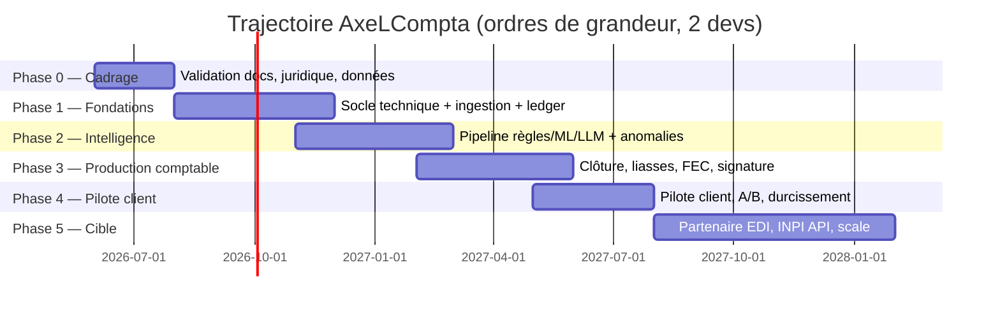

# 12 — Roadmap et TODO maître

> Statut : brouillon à valider. Dernière mise à jour : 2026-09-26.
> **Seule source de l'état du projet** (fait, en cours, jalons). Les docs 17
> et 18 n'en tiennent plus de copie. Les sections « Statuts » des READMEs de
> modules en gardent une, en partie périmée, à retirer.
>
> Hypothèse de capacité : **1 dev (Louis, seul sur le produit)** — l'associé
> initialement pressenti n'est plus sur ce produit (segmentation actée le
> week-end du 2026-09-05/06, voir §0.1). Les durées de ce doc supposaient
> encore 1 à 2 devs à sa rédaction (2026-08-01) : à recalibrer, étirer
> d'environ ×1,7 par rapport aux ordres de grandeur ci-dessous.
>
> **Ce doc a pris du retard sur le code** entre le 01/08 et le 02/09 : le
> sprint du 2026-09-02 au 2026-09-06 (voir doc 17, doc 18) a produit
> l'essentiel du moteur démo, l'audit dataset et une première UI — pas
> encore reflété ligne à ligne ci-dessous. Les sections §0.2 et §0.3 ont été
> corrigées pour refléter l'état réel ; le reste (phases 1-5) reste à
> recaler sur ce qui existe déjà en code (doc 18) avant de servir à nouveau
> de plan d'exécution fiable.

## Recalage du 2026-09-21 (à lire avant tout le reste)

Un imprévu a interrompu le travail du 2026-09-12 au 2026-09-20 environ : aucun
commit depuis le 2026-09-11, seule la préparation de la relecture des 500
lignes a avancé (le 13/09). Les échéances « week-end du 12/13 » ci-dessous ne
sont pas tenues. Ce bloc les remplace ; le gantt et les durées des phases plus
bas restent des ordres de grandeur non recalés, à ne pas lire comme des dates.

**Fait pendant ce recalage :** écart ML tranché (ADR-007 amendé, 79,5 % de
référence, le 94,4 % venait du token PCG absent à l'inférence).

**Fait le 2026-09-23 (doc 17 §15), hors jalons :** liasse fiscale complète
(2065, 2065-bis, 2033-A à G) sur les formulaires officiels 2026, clôture
fiscale (TVA, IS, réintégrations), FEC conforme au texte de l'A.47 A-1,
identité légale des dossiers. Pas d'expert-comptable pour la démo (décision
de Louis) : le J6 ne bloque pas la démo, il reste un prérequis de la V1.

**Fait le 2026-09-24, hors démo et prévu (doc 17 §16) :** durcissement V1
tiré des items §1.1 à §1.3 de ce doc, pas du plan de démo. Signature greffe
persistée en Postgres (PR #4), écritures validées verrouillées (I2, PR #5),
classement du consentement bancaire à J-14 à chaque synchro (PR #6), journal
d'audit append-only des décisions et signatures (PR #7), décisions et
signatures verrouillées en base (PR #8), contre-passation d'une transaction
modifiée ou supprimée côté Digifactory (PR #9). scikit-learn épinglé en 1.9.0
(PR #3). Le détail est coché dans §1.1 (journal), §1.2 (consentements) et
§1.3 (verrous) ci-dessous. Les PR #6 à #10 avaient été mergées dans des
branches empilées au lieu de `main` ; rattrapées le même jour par une PR
unique.

**Fait le 2026-09-24 (soir) : base applicative sur Supabase** (ADR-003).
Jusqu'ici seule l'auth y était ; les données restaient sur un Postgres docker
local. Migrations et seed de démo appliqués sur le projet `AxelCompta-demo`,
API vérifiée de bout en bout. Le docker local ne sert plus qu'aux tests
d'intégration, verrouillés sur une base locale. Droits par défaut de `anon`
et `authenticated` retirés (migration `e4c7a9d25b13`).

**Fait le 2026-09-25 : écran gestionnaire** (PR #13 à #15). Liste des
entreprises sur `/portefeuille`, deux frises réglementaires par entreprise,
rappels (règles enregistrées, envoi non branché), équipe avec rôles Admin,
Membre et Lecture, nom d'organisation, retrait d'une entreprise, liens
Supabase ouverts dans l'application, premier chargement Digifactory découpé.
La frise de l'année d'avant montre l'exercice terminé en cours de
traitement, jamais cochée d'office (doc 19 §2.1).

**Fait le 2026-09-25/26 (PR #17 et #18) :**
- Frise par jalons : chaque étape après le compte (clôture, signature de
  validation, greffe, impôts, signature légale) est une preuve dans
  `documents_signes`, et la frise s'arrête au premier jalon absent
  (`demo_jalons.py`, `demo_seed.poser_jalons_demo`).
- Refonte UX du parcours chauffeur (retour du 22/09) : app utilisable au
  téléphone, jusqu'à la liasse et au greffe.
- Menu Démo du gestionnaire : remise à neuf à la carte. Les données
  verrouillées s'effacent par la connexion propriétaire, verrous suspendus
  le temps d'une seule transaction, portefeuille de démo et admin seulement
  (`demo_admin.py`, doc 17 §6).

**Jalons recalés** (proposition à confirmer ; tant qu'aucune date externe
n'est imposée, on suit l'ordre plutôt que les dates) :

| Jalon | Cible | Pourquoi dans cet ordre |
|---|---|---|
| J1. 500 lignes relues (~2 h avec la pré-passe), **week-end uniquement** | 2026-09-26/27 | Débloque la vraie mesure ML et le premier jeu de test gelé |
| ~~J2. Liste pilote statut/régime/TVA par chauffeur~~ **Annulé le 2026-09-26** (décision de Louis) : on code tous les formats (SASU, SAS, EURL, SARL, EI, IS, IR, franchise ou réel de TVA), le mélange exact du pilote n'a plus à être collecté à l'avance. Le statut de chaque dossier reste à renseigner, dossier par dossier, quand il est créé | annulé | |
| J3. Digifactory branché, synchro idempotente avec curseur, archive brute et quarantaine (**code fait le 2026-09-22**, doc 18) ; reste : un vrai dossier de bout en bout. Digifactory n'a que 6 contacts au 2026-09-26, c'est attendu : la démo sert à obtenir l'engagement du pilote, les chauffeurs y seront ajoutés ensuite. Le vrai dossier de bout en bout peut se faire sur l'un des 6 | 2026-10-02 | Premier flux réel, remplace les fixtures |
| J4. Auth gestionnaire réelle + Postgres branché dans l'API + migrations (**fait le 2026-09-21**, doc 18) | fait | Aujourd'hui tout est en mémoire, `UTILISATEUR_DEMO` en dur |
| J5. Notifications + invitations en masse (**code fait le 2026-09-22**). **Notifications internes depuis le 2026-09-26** (cloche de l'espace chauffeur, plus d'e-mail : e-mail et SMS sont des intégrations du gestionnaire) et **cron installé** (`axelcompta.taches`, toutes les heures sur le poste de démo, même script sur le futur serveur). SMTP de Supabase Auth configuré le 2026-09-26 (invitations plus plafonnées) | fait | |
| J6. Premier échange expert-comptable (taxonomie, templates, question CCA/FNP). **Reporté tout à la fin le 2026-09-26** (décision de Louis) : aucun expert-comptable disponible aujourd'hui, pas de moyen de le lancer. Ne pas le relancer d'ici là | tout à la fin | Reste un prérequis de la V1 |

**À lancer en parallèle dès cette semaine (attente externe, coût faible) :**
devis de signature qualifiée RGS (ADR-004), trame CGU/CGV/DPA, relance
Digifactory pour le volume initial découpé (doc 16 §5).

**Contrainte de rythme (2026-09-21) :** les tâches qui demandent le jugement de Louis sur les données (relecture des 500 lignes, données pilote) ne se font que le week-end ; la semaine est réservée au code. Le J4 et le J5 sont donc les jalons de semaine, faisables sans attendre J1.

**Capacité :** 1 dev seul, et cette estimation ne réserve aucun temps pour
d'autres engagements (mémoire, études). Si un autre chantier prend la même
énergie, les cibles glissent d'autant ; le J1 est le seul qui ne
doit pas glisser, parce que tout le reste en dépend.

## Vue d'ensemble des phases

Jalon de fin de phase = démo + revue de la check-list de phase. On ne commence pas
la phase suivante avec des invariants non tenus.

---

## Phase 0 — Cadrage et dé-risquage (AVANT d'écrire du code produit)

### 0.1 Décisions et juridique
- [x] ~~Relecture/amendement de toute cette documentation par Louis + associé.~~
      **Annulé (2026-09-07)** : l'associé n'est plus sur ce produit —
      segmentation actée le week-end du 2026-09-05/06. Louis seul sur le
      produit (voir hypothèse de capacité en tête de doc). **Louis avait
      déjà relu (2026-09-02)** ; la condition du README avant "code produit"
      est donc satisfaite côté relecture — plus d'associé à attendre. Sujet
      clos, ne pas rouvrir.
- [x] Structure du pilote confirmée : 1 gestionnaire → ~200 dossiers indépendants, mix SASU/EURL à l'IS + quelques option IR.
      ~~Collecter la liste exacte statut par chauffeur~~ **Annulé le
      2026-09-26** : tous les formats seront codés, le statut se renseigne
      dossier par dossier à la création (voir J2 dans le recalage).
- [x] Positionnement éditeur validé (doc 02 §2.3).
- [ ] CGU/CGV + DPA rédigés (trame au moins).
- [x] Token Digifactory fonctionnel — **débloqué le 2026-09-11** (doc 16
      §7) : mauvais type d'en-tête depuis le début (`Authorization: Bearer`
      au lieu de `X_DIGI_TOKEN`, spec initiale erronée du fournisseur, rien
      de cassé côté client). Les 4 routes (`/contacts`, `/categories`,
      `/accounts`, `/transactions`) répondent 200 en réel. Chemin A
      implémenté et testé en réel (`DigifactoryHttpClient`, doc 16 §7/§9
      point 1). Reste : brancher ce client sur `fetch_transactions` —
      bloqué sur la table `contact_nr → dossier_id` (doc 16 §9 point 5),
      pas un problème technique : dépend de l'arrivée des chauffeurs chez
      Digifactory (voir J3 dans le recalage).
- [ ] Contrat Bridge direct : pricing, volumes, statut, sandbox — piste parallèle non bloquante, testée après le pilote Digifactory (doc 16 §8).
- [ ] Contrat Rollee : conditions fleet mode, volumes, API sandbox, pricing.
- [ ] Choix prestataire signature (ADR-004) — devis Yousign/Docusign. **Précisé (2026-09-11, doc 20 §4)** : le dépôt des comptes annuels au greffe (INPI) exige spécifiquement une signature électronique **avancée avec certificat qualifié RGS** (C. com. art. R.123-5) — à vérifier explicitement dans le devis retenu, pas n'importe quel niveau de signature électronique.
- [ ] Décision hébergement prod (ADR-003) après premier échange sécurité banque.
- [ ] **Écrire les ADR 001-006** (docs/adr/) — templates disponibles, à valider.

### 0.2 Les données (chemin critique — démarrer immédiatement)
- [x] Récupérer un échantillon des 10 ans d'historique.
- [x] **Vérifier le risque n° 1** : le lien libellé bancaire ↔ imputation existe-t-il ? (doc 07 §2.1) — **fait (2026-09-02)** : lien structurel fiable à 100% côté FEC historique, lien sémantique plus faible sur les paiements carte génériques. Détail : `_AUDIT_DONNEES/rapport_audit_dataset.md` §2.
- [x] Rapport d'audit du dataset (formats, volume, qualité des labels, droits) — **fait (2026-09-02)**, brouillon Claude non relu par Louis ni un comptable (`_AUDIT_DONNEES/rapport_audit_dataset.md`).
- [x] Construire la taxonomie du **pack VTC** (~40-80 classes) avec le comptable du client — structurée comme un pack métier dès le départ (doc 03 §3bis). **Fait (2026-09-02) côté brouillon algorithmique** (`_AUDIT_DONNEES/packs_vtc/taxonomie.md`, 30 catégories) — **pas encore fait avec le comptable du client**, c'est l'écart réel derrière cette case.
- [x] Table de mapping comptes historiques → taxonomie — **fait (2026-09-02)**, brouillon (`_AUDIT_DONNEES/packs_vtc/mapping_pcg_categorie.csv`), même réserve que ci-dessus.
- [ ] 500 lignes relues à la main = premier jeu de test gelé. Échantillon
      généré (`_AUDIT_DONNEES/resultats/echantillon_500_a_relire.csv`),
      **7/500 relues à ce jour (2026-09-21)**, outillage prêt
      (`relecture_rapide.py`, pré-passe qui réduit à ~200 lignes à regarder).
      Prévu le week-end du 2026-09-12/13, **non fait** ; nouvelle cible dans le
      recalage ci-dessous.

### 0.3 Spike techniques (timeboxés, 2-3 jours chacun)
- [x] Spike Digifactory : premier appel réussi — **fait le 2026-09-11** (doc 16 §7), les 4 routes en 200 réel. `/contacts` expose `siren`/`siret`/`vatno` en champs distincts (Pierre a corrigé le même jour un champ `siret` à double usage repéré lors du premier test, doc 16 §3.3) ; au moins un contact sans aucun des trois dans l'échantillon, confirmant qu'il faut une table de correspondance explicite. Poids réel mesuré : ~807 Ko/2029 transactions pour un seul contact sans filtre `since` (doc 16 §5) — confirme qu'un chargement initial sur 200 dossiers doit être découpé, pas lancé tel quel.
- [ ] Spike Bridge sandbox direct : connexion, récupération transactions, webhooks — piste parallèle non bloquante, après stabilisation du canal Digifactory (doc 16 §8).
- [x] Spike baseline ML : TF-IDF + régression logistique sur le même échantillon — **fait (2026-09-02)**, 79,5% d'exactitude sur dossiers jamais vus (`_AUDIT_DONNEES/rapport_audit_dataset.md` §6). **Écart avec ADR-007 tranché (2026-09-21)** : le 94,4% venait du token compte PCG, absent à l'inférence (mesure refaite : 96,3% avec le token, 79,5% sans). ADR-007 amendé, chiffre de référence 79,5%. Reste ouverte la vraie mesure de précision, qui dépend des 500 lignes relues (§0.2). Le spike d'origine n'est plus dans le repo, donc le classement sentence-transformers/CamemBERT est invérifiable ; volet embeddings non fait, à rouvrir seulement si les 500 lignes montrent une précision insuffisante.
- [ ] Spike OCR : 30 tickets réels dans Tesseract vs PaddleOCR vs Vision LLM (ADR-005).
- [ ] Spike FEC : générer un FEC minimal et le passer dans « Test Compta Demat ».
- [ ] Maquettes Figma des 3 écrans clés (doc 11 §3) + retours de 2 utilisateurs cibles.

**Critère de sortie Phase 0** : dataset audité, baseline ML mesurée, Digifactory
testé (ou développement mené contre fixtures si le token reste bloqué — doc 16
§7), décisions ADR 001-005 actées, docs validées.

---

## Phase 1 — Fondations (socle + ingestion + cœur comptable)

### 1.1 Socle technique
- [ ] Monorepo (backend + front), Docker Compose dev (Postgres, MinIO).
- [ ] CI complète dès le premier jour (doc 08 §4) — la barrière avant le code, pas après.
- [ ] `core/` : Money (centimes), Result, erreurs, identifiants typés + tests de propriétés.
- [x] Multi-tenant : modèles tenant (mode portefeuille/mono) + dossier — **fait**. RLS, middleware d'isolation + suite de tests d'isolation — **posés le 2026-09-22** (doc 03 §7, migration `87fc7238e52e`), sur le schéma de démo actuel. Reste pour le vrai V1 : étendre aux tables futures au fur et à mesure qu'elles apparaissent (chaque nouvelle table dossier-scopée doit recevoir sa policy dans la même migration qui la crée, pas après coup).
- [x] **Configuration de dossier de premier rang** : statut juridique + régime fiscal + régime TVA + pack métier, matrice doc 06 §7 en données versionnées (toutes les colonnes dans le modèle, IS et option IR opérationnelles). Chaque dossier indépendant, valeurs tenant en simple pré-remplissage.
      **Fait le 2026-09-26** : `tenants/matrice_statuts.toml` + `statuts.py`,
      formes SASU, SAS, EURL, SARL, EI et régimes IS, option_IR, IR, micro,
      TVA réel normal, réel simplifié (avant 2027) et franchise, pack métier,
      année de début d'option IR. Validation à chaque écriture de dossier.
      Le moteur lit la matrice : compte d'usage personnel (455, 108, ou
      signalé sans écriture), IS seulement pour la colonne à l'IS, 2065 et
      dépôt au greffe refusés (409) hors de leur colonne. Reste : la liasse
      2031 (IR), la 2050 (réel normal), la franchise dans la clôture, puis
      les alertes et la bascule de fin d'option IR (item suivant).
- [ ] **Option IR bornée** : date de début d'option, décompte des 5 exercices, alertes N-1/N, bascule IS tracée (doc 06 §7) + changement de régime par avenant daté (mécanique générique).
- [ ] **Création de dossiers en masse** : import CSV/XLSX de la configuration (SIREN, forme, régime, dates d'exercice, option IR…) pour onboarder 200 dossiers sans 200 saisies manuelles, avec rapport de validation avant création.
- [ ] Auth B2B : email + MFA TOTP, rôles V1, journal d'audit append-only. **Tranche journal (2026-09-24)** : décisions et signatures seulement (`journal_audit`). Auth/MFA et le journal consultations/exports restent ouverts.
- [ ] Observabilité : logs JSON structurés, Sentry, premières métriques.

### 1.2 Ingestion
- [ ] Archivage brut immuable (hash, horodatage) de tout ce qui entre.
- [ ] **Interface `DataProvider` (ABC)** dans `ingestion/providers/base.py` + types `NormalizedTransaction`, `PlatformSettlement` (doc 13 §2).
- [ ] **`DigifactoryProvider`** (canal actif pour le pilote, doc 16) : contacts/comptes/transactions, sync incrémental sur `since` (pull, pas de webhook), santé des connexions (`paused`/`data_access`/`last_refresh_status`), table de correspondance `contact_nr → dossier_id`, fixtures couvrant les cas doc 16 §9.7.
- [ ] **`BridgeProvider`** direct : piste parallèle non bloquante (sandbox, doc 16 §8), à développer après le pilote Digifactory — items/comptes/transactions, polling + webhooks, santé des connexions, monitoring expiration consentements DSP2.
- [ ] **`RolleeProvider`** : connexion fleet mode, endpoints income/trips/wallet, webhooks `wallet.payout_received`, polling daily fallback, monitoring expiration tokens (doc 13 §3).
- [ ] **`FileImportProvider`** : moteur de profils d'import + parseurs CSV/XLSX/ODS → `RawRow` canonique.
- [ ] **Réconciliation `PlatformSettlement` ↔ `NormalizedTransaction`** : algorithme de matching par montant+date+libellé, états (en attente / réconcilié / revue manuelle), alertes trou (doc 13 §4).
- [ ] **Dashboard consentements** : panneau premier rang listant consentements valides/expirant/expirés pour Digifactory (accès bancaire) et Rollee. Mode relance configurable par tenant (auto ou manuel, doc 14 §2.3) — date d'expiration DSP2 **confirmée exposée côté Digifactory depuis le 2026-09-11** (`item.authentication_expires_at`, doc 16 §3.2/§6). **Classement persisté le 2026-09-24** à chaque synchro (`consentements_bancaires`) : actif / à renouveler (J-14) / expiré / jamais connecté. **Santé de connexion persistée le 2026-09-25** sur la même ligne. L'écran et les e-mails de relance restent à faire. Rollee n'est pas couvert.
- [ ] Normalisation des libellés versionné + tests.
- [ ] Déduplication/idempotence + rapport d'import avec prévisualisation.
- [ ] Quarantaine + UI de correction.
- [ ] Fixtures : un corpus de fichiers par banque rencontrée + corpus de payloads Rollee (vivant, doc 09 §2.2).

### 1.3 Cœur comptable (`ledger`)
- [ ] Plan de comptes PCG embarqué versionné + comptes par dossier + axe analytique.
- [ ] Écritures append-only, partie double, séquences par journal, périodes + verrous (invariants I1-I8 + triggers de protection). **Fait le 2026-09-24 pour I2** : trigger sur les écritures validées, et contre-passation d'une transaction bancaire modifiée ou supprimée après comptabilisation (doc 06). Séquences, périodes et verrou de clôture (I4) restent ouverts.
- [ ] Mécanique générique « template + paramètres dossier → écritures équilibrées » (le moteur ne connaît aucun secteur).
- [ ] **Templates pack VTC** (fichiers de données `packs/vtc/`) : carburant (TVA récupération selon véhicule), péage, entretien, LOA (part non déductible), usage personnel (455/108 selon statut), banale charge TTC/HT/TVA.
- [ ] **Templates recettes plateformes** : settlement Rollee → 706 + 44571 (10% ou franchise) + 622x + 44566 (TVA commission selon entité Uber/Bolt — doc 13 §5). Config plateformes dans `packs/vtc/platforms.yaml`.
- [ ] Immobilisations : fiche, plan d'amortissement linéaire, prorata, cession + tests de propriétés (Σ dotations = base).
- [ ] LOA : loyers, part non déductible, suivi hors-bilan, levée d'option.
- [ ] Paramétrage TVA par dossier : `tva_recettes_regime` (assujetti_taux_reduit | franchise), régime déclaration (réel normal — cible unique nouveaux dossiers ; réel simplifié en lecture d'historique seulement, supprimé au 01/01/2027, doc 02 §7bis), surveillance des seuils franchise. Table de règles fiscales versionnée par millésime.
- [ ] Rapprochement bancaire.
- [ ] Dossiers de référence synthétiques → golden tests : SASU IS + Rollee settlements, EURL option IR, dossier franchise TVA, dossier traversant fin d'option IR.
- [ ] **Relecture des templates par un expert-comptable** (prestation, doc 09 §8) — obligatoire avant V1.

### 1.4 Front (en parallèle)
- [ ] Design system de base (tokens, composants, Storybook).
- [ ] Écrans : connexion/MFA, dashboard, liste/fiche dossier, transactions, import avec prévisualisation, journaux/balance (lecture).

**Critère de sortie Phase 1** : un fichier CSV réel importé → écritures manuellement
validées → balance équilibrée et FEC brut généré, le tout démontré sur staging,
couverture ledger ≥ 95 %.

---

## Phase 2 — Intelligence (catégorisation + anomalies)

### 2.1 Règles dures
- [ ] Moteur de règles déclaratives 3 niveaux (système/tenant/dossier) + priorités + journal de collisions.
- [ ] Règles avec tests embarqués obligatoires, exécutés en CI.
- [ ] Premier référentiel : ~100-200 règles système du pack VTC (enseignes carburant, péages, plateformes, assurances…) construites depuis le dataset historique.
- [ ] UI de gestion des règles + création assistée depuis une correction.

### 2.2 ML
- [ ] Pipeline de données : dataset versionné, splits par dossier ET période, pseudonymisation.
- [ ] Baseline (TF-IDF + LogReg) → rapport d'évaluation (doc 07 §4).
- [ ] Challenger LightGBM features mixtes ; calibration isotonic ; seuils par classe.
- [ ] Registry de modèles (table + artefacts S3), promotion champion/candidat, rollback.
- [ ] Intégration runtime : chargement champion, prédiction, explication (top features).
- [ ] Jeu des pièges construit à la main + jeu de test gelé.
- [ ] Monitoring de dérive (taux de correction par classe, confiances).

### 2.3 LLM
- [ ] **Module de pseudonymisation + tests de fuite bloquants** (doc 10 §4) — avant le premier appel réel.
- [ ] Abstraction LLMProvider (Claude/Gemini/OpenAI), sortie JSON schema contrainte, retry/fallback, cache par libellé-type, budget par tenant.
- [ ] Politique de décision ML×LLM (doc 05 §4) + journalisation des motifs d'escalade.

### 2.4 Pipeline assemblé + revue humaine
- [ ] Orchestration 4 étages + auto-validation configurable par tenant.
- [ ] **File de revue** (l'écran clé, doc 11 §3.1) avec raccourcis clavier — **côté indiv, pas gestionnaire, depuis le 2026-09-11 (doc 19 §5.2)**, déclenchée par notification au fil de l'eau plutôt qu'en session groupée.
- [ ] Boucle de feedback : corrections → labels → réentraînement mensuel → rapport.
- [ ] Tests de la matrice de scénarios pipeline (doc 09 §2.3).

### 2.5 Anomalies
- [ ] **Profils comportementaux par dossier** (doc 05 §6.2, doc 07 §3.3) : agrégats incrémentaux par catégorie, construits automatiquement à l'import de l'historique.
- [ ] Détecteurs V1 : catégories personnelles, enseigne ambiguë sans/avec ticket incohérent, écart au profil comportemental (3σ), doublons de pièce, double plein.
- [ ] Cycle de vie d'alerte + UI d'instruction (doc 11 §3.2, écart au profil affiché) + templates comptables de résolution (455/108 selon statut du dossier).
- [ ] Jeu d'évaluation : abus historiques connus + abus synthétiques injectés ; mesure rappel/précision.

### 2.6 Justificatifs
- [ ] Stockage WORM, upload UI + adresse email par dossier.
- [ ] Cascade extraction : PDF natif → Factur-X → OCR → Vision LLM, confiance par champ.
- [ ] Matching justificatif↔transaction scoré + file de matching manuel + orphelins.
- [ ] Golden tests OCR (corpus 200 documents annotés).

### 2.7 Accès chauffeur en libre-service (mobile) — cadré dans doc 19, pas encore codé

Contredit le modèle initial : doc 11 §3.3 disait que la page de signature
est « seul écran vu par le chauffeur/gérant » (zéro compte, lien + OTP) ;
doc 04 §4.3 disait que les justificatifs arrivent via le gestionnaire ou par
mail, « vu qu'ils n'ont pas accès à la plateforme ». Louis veut (2026-09-05,
précisé le 2026-09-06) : le chauffeur a son propre compte, relié à ses
propres écritures bancaires, avec une vraie app (mobile) — prend ses tickets
en photo lui-même, répond à des questions de catégorisation simples quand
le système ne sait pas, et peut relier sa propre banque si besoin. **Cadré
et documenté dans [doc 19 — Parcours utilisateur](19-parcours-utilisateur.md)**
(session Claude Code du 2026-09-06) : modèle de compte/onboarding, deux
modes de connexion bancaire par dossier, logique du mode mono-compte. Le
[doc 17](17-plan-demo-backend.md) (plan de démo, pivoté le même jour) en
fait maintenant une des deux interfaces de la démo. Reste à faire : le
code — rien de ceci n'est encore construit. Ne pas confondre avec le flux
Rollee Connect chauffeur (doc 13 §3.3), qui lui est déjà spec depuis le
début.

**Révision structurante du 2026-09-11 (doc 19)** : ce n'est plus juste
« le chauffeur a en plus un accès mobile » — la file de revue, la clôture
et la signature **quittent le gestionnaire pour devenir exclusivement
indiv**. Nouveaux items concrets qui en découlent, aucun encore chiffré :

- [x] **Système de notification** (doc 19 §5.2) : **fait le 2026-09-22,
      internes depuis le 2026-09-26** (décision de Louis : pas de SMTP chez
      nous, la cloche de l'espace chauffeur est le canal ; e-mail et SMS
      sont des intégrations que le gestionnaire branche). Déclenchées par
      `python -m axelcompta.taches` depuis un cron (poste de démo ; serveur
      plus tard, même script). Reste : l'écran d'intégrations du
      gestionnaire (e-mail, SMS), pas décidé.
      Avant : dès qu'une transaction arrive et que le pipeline ne sait pas
      trancher, notifier l'indiv —
      rien n'existait (pas d'email transactionnel, pas de push/in-app).
      Objectif produit : traitement au fil de l'eau, pas une revue de fin
      d'année (répartit aussi notre charge support/LLM sur l'année, doc 09
      §7).
- [x] **Import en masse des invitations** (doc 19 §3.1) : **fait le
      2026-09-22** : `POST /invitations/en-masse` (500 lignes max, résultat
      ligne par ligne, dossiers d'un autre portefeuille traités comme
      inconnus) et un écran de collage/fichier sur le dashboard gestionnaire.
      Le gestionnaire invite ses indivs depuis une base clients, pas seulement
      un par un — distinct du CSV dossiers (§1.1 ci-dessus), **qui reste à
      faire pour le pilote** (pas pour la démo).
      Les invitations partent de Supabase Auth, dont l'envoi était plafonné
      sans SMTP personnalisé : **SMTP configuré le 2026-09-26**, un lot de
      200 invitations peut partir en entier.
- [ ] **Boucle de clôture/complétude bancaire** (doc 19 §5.3, doc 06 §5bis) :
      confirmation de l'indiv + délai de battement + CCA/FNP pour le
      résiduel — la durée du délai et la politique CCA/FNP restent à
      valider avec un expert-comptable, pas tranchées.
- [ ] **Deux signatures distinctes** (doc 20 §4bis) : une validation
      (protège AxeLCompta, pas besoin de qualifié) avant tout envoi, une
      signature légale qualifiée RGS sur le retour des organismes — ne pas
      les traiter comme une seule étape répétée.
- [ ] **Visibilité gestionnaire, confirmation juridique requise** (doc 19
      §2.4, doc 02 §10) : le gestionnaire ne voit que des agrégats tant que
      ce n'est pas confirmé légalement — même « documents déposés : oui/non »
      par dossier est en attente de validation, pas codé par défaut.

**Critère de sortie Phase 2** : sur le dataset historique rejoué, ≥ 85 % de
catégorisation automatique à ≥ 97 % de précision, rappel anomalies ≥ 80 %,
zéro fuite au test de pseudonymisation.

---

## Phase 3 — Production comptable complète

- [ ] Checklist de clôture automatisée (doc 06 §5) : CCA/FNP assistées, cadrage TVA, dotations, réintégrations fiscales (plafonds VP, LOA), IS.
- [ ] **Liasse pivot** case-par-case alignée dictionnaire TDFC, formulaires sélectionnés par le statut du dossier : 2065 + 2050/2033 (IS) et 2031 + annexes (option IR) + contrôles de cohérence inter-cases. **Avancé le 2026-09-23 (doc 17 §15)** : 2065 + 2033-A à G complets pour l'IS au régime simplifié, cases indexées par le code officiel, sans relecture d'expert-comptable (décision démo). **2031 + 2031-bis faits le 2026-09-26** pour la colonne à l'IR (EURL, SARL de famille, option 239 bis AB), 2033 jointe, pas d'IS ni de 2065 ; la colonne `societe_ir` de la matrice passe opérationnelle, et l'écran Exercice propose la 2065 ou la 2031 et masque le dépôt au greffe selon la matrice. Restent : 2050-2059 (réel normal), EI au réel (bilan de l'exploitant, dossier de référence), alignement sur le dictionnaire TDFC, contrôles inter-cases formalisés.
- [ ] Renderers : FEC final (CI « Test Compta Demat »), PDF liasse fidèle CERFA, balance/GL/journaux exports, CA3 pré-remplie (CA12 en lecture d'historique seulement, doc 02 §7bis). **Avancé le 2026-09-23** : FEC conforme au texte de l'A.47 A-1 (pas encore passé dans Test Compta Demat), PDF 2065 + 2033 sur les formulaires officiels 2026, grand livre et balance en PDF.
- [ ] Dossier de dépôt comptes annuels (Guichet Unique INPI) — génération, dépôt manuel documenté.
- [ ] Dossiers de référence supplémentaires (EURL avec LOA, EURL option IR clôturée, dossier traversant la **fin d'option IR** : exercice N en IR → N+1 en IS) en golden tests — un par colonne opérationnelle de la matrice doc 06 §7.
- [ ] Circuit de validation/relecture interne (statuts, verrous, doc 02 §2.3 — l'humain valide, c'est journalisé).
- [ ] Intégration signature électronique : paquets de documents, lien OTP mobile-first, suivi, relances (doc 11 §3.3).
- [ ] Workflow complet démontré : exercice clôturé → liasse → envoyée → signée → archivée.
- [ ] Deuxième relecture expert-comptable (clôture + liasses).

**Critère de sortie Phase 3** : un exercice complet du dossier de référence clôturé
de bout en bout, liasse conforme, FEC accepté, signature réelle effectuée sur staging.

---

## Phase 4 — Pilote client et durcissement

- [ ] Onboarding du tenant pilote : collecte de la liste statut/régime/TVA par chauffeur, création en masse des ~200 dossiers (chacun paramétré individuellement), profils d'import, reprise d'historique réelle.
- [ ] Adaptation ML au pilote (sur-pondération, doc 07 §3.3) + règles tenant.
- [ ] A/B testing : seuils d'auto-validation, présentation des explications (cadrage initial).
- [ ] Charge : reprise 10 ans (~3 M lignes), clôtures groupées (doc 09 §7).
- [ ] Chaos : pannes LLM/Digifactory/worker → reprise propre prouvée.
- [ ] Test d'intrusion externe + corrections.
- [ ] Runbook incident + exercice sur table (doc 10 §6).
- [ ] Restauration de sauvegarde chronométrée.
- [ ] Questionnaire sécurité du client complété ; SSO si exigé.
- [ ] Période de marche en double : la compta pilote produite en parallèle de
      l'existant pendant 2-3 mois, écarts analysés → c'est LE test de vérité.

**Critère de sortie Phase 4** : 3 mois de marche en double sans écart inexpliqué,
KPIs V1 atteints (doc 01 §6), feu vert du client.

---

## Phase 5 — Trajectoire cible

- [ ] Dossier d'habilitation **Partenaire EDI** déposé (doc 02 §5) : pièces administratives, clé publique, RDV correspondant régional.
- [ ] Génération EDIFACT/TDFC depuis la liasse pivot + attestation de conformité EDIFICAS.
- [ ] Télétransmission test puis réelle (TDFC, EDI-TVA) ; en attendant : intégration partenaire EDI tiers si le volume le justifie.
- [ ] API INPI Guichet Unique pour le dépôt des comptes.
- [ ] Onboarding industrialisé d'un nouveau client : < 2 semaines données → modèle adapté (doc 07 §3.3).
- [ ] **Nouveaux packs statut** selon la demande : EI au réel, micro-entreprise (livre des recettes + jauges de seuils), BNC/2035… (matrice doc 06 §7 — données et templates, pas de refonte).
- [ ] **Nouveaux packs métier** au premier client hors VTC : taxonomie, règles, templates du secteur.
- [ ] **UI mode mono-entreprise** : habillage direct sur le dossier unique (doc 11 §1bis) — la couche dossier existe déjà, on retire la couche portefeuille.
- [ ] Ingestion Factur-X via Plateformes Agréées (réforme 2026-2027).
- [ ] Étude certification NF 203 ; SSO entreprise ; mode sombre ; selon demande.

---

## Backlog transverse permanent (jamais « fini »)

- Chaque bug prod cœur comptable → post-mortem + fixture de non-régression (doc 09 §9).
- Veille millésimes fiscaux (TDFC, taux, plafonds CO2) → mise à jour des tables versionnées + goldens.
- Veille jurisprudence ordonnance 1945 (doc 02).
- Revue mensuelle des motifs d'escalade LLM → nouvelles règles.
- Échantillonnage mensuel des prompts sortants (contrôle pseudonymisation).
- Renouvellement dépendances (PR auto hebdo/mensuelle).

## Règles de pilotage du projet

1. **Le chemin critique est la donnée, pas le code** : l'audit du dataset (0.2) et
   la marche en double (4) sont les deux moments de vérité du projet.
2. À chaque fin de phase : revue des KPIs, mise à jour des docs, go/no-go explicite.
3. Tout ce qui touche au réglementaire (FEC, liasse, TVA) est validé par un
   expert-comptable avant production — budget récurrent assumé.
4. Périmètre V1 défendu agressivement : tout ce qui n'est pas dans les docs 01-12
   passe par une décision écrite (ADR ou mise à jour de doc), pas par un « vite fait ».
