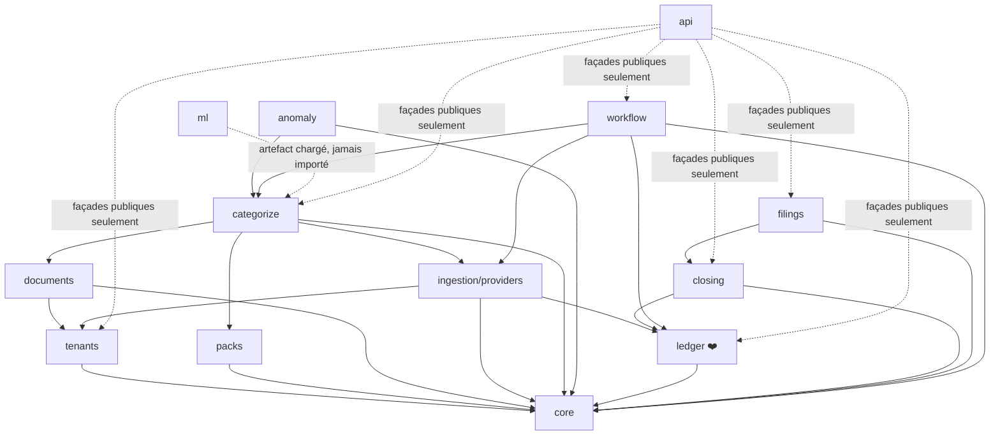

# 18 — Organisation du code

> Carte du code : où vit chaque module et quelles dépendances il a le droit
> d'avoir. L'état d'avancement n'est pas ici, il est dans le
> [doc 12](12-roadmap-todo.md). Dernière mise à jour : 2026-09-25.

Ce doc fait le lien entre l'arborescence réelle du repo (`backend/`,
`frontend/`) et le découpage en modules défini en [doc 03 §3](03-architecture.md#3--découpage-en-modules-monolithe-modulaire).
Chaque dossier de `backend/axelcompta/*/` a son propre `README.md` avec le
même triptyque : **rôle**, **statut démo (doc 17)** vs **statut V1 (doc 12)**,
**doc de référence**.

## Pourquoi l'arbre complet dès maintenant, alors que seule la démo est visée à court terme

Le module `ledger/` (par exemple) doit être écrit une fois, bien, avec les
bonnes frontières de dépendance — pas retravaillé quand on passera de la
démo à la V1. L'arbre ci-dessous est donc celui **du produit final** ; ce
qui change entre démo et V1, c'est le contenu de chaque dossier, jamais sa
position ni ses règles de dépendance.

## Vue d'ensemble

```text
AxeLCompta/
├── backend/axelcompta/
│   ├── core/          # Money, ids, erreurs, identité légale, accès DB
│   ├── tenants/       # portefeuilles et dossiers en Postgres, RLS par tenant et par dossier
│   ├── packs/         # pack VTC réduit (V1 : taxonomie complète)
│   ├── ingestion/
│   │   └── providers/ # DataProvider ; démo sur fixtures, synchro Digifactory codée
│   ├── documents/     # V1 (OCR) ; les justificatifs photo de la démo sont dans demo_justificatifs.py
│   ├── categorize/    # règles + ML, pas de LLM
│   ├── anomaly/       # V1 seulement
│   ├── ledger/        # moteur pur, Postgres, écritures validées immuables
│   ├── closing/       # clôture fiscale IS : TVA, IS, liasse 2033
│   ├── filings/       # CERFA 2065 + 2033 officiels, FEC légal, PDF (V1 : EDI/INPI)
│   ├── workflow/      # décisions humaines, signatures démo, journal d'audit, notifications
│   ├── api/           # V1 ; la démo passe par demo_api.py (Supabase Auth, exception ADR-003)
│   └── ml/            # modèle déjà entraîné, réutilisé tel quel
├── frontend/          # Next.js : écrans gestionnaire (web) et chauffeur (mobile), auth Supabase
└── _AUDIT_DONNEES/    # audit du dataset historique, source pour packs/ et categorize/
```

## Graphe de dépendances (règle vérifiée par import-linter en CI, doc 03 §3)



**Ce que ce graphe interdit, explicitement (doc 03 §3) :**
- `ledger` → `categorize`, `ml`, ou `api` : jamais, dans aucun sens.
- `categorize` → `ledger` directement : passe obligatoirement par `workflow`.
- Tout import direct de `ml` au runtime : les modèles sont des artefacts chargés.

## Ce qui se passe en pratique pour la démo (doc 17)

La coupe verticale de la démo (« faire tourner tout le pipeline bout-en-bout
dès les premiers jours », doc 17 §2) traverse tous les modules « actif » ou
« réduit » du tableau ci-dessus. **Semaine 0 (faite) saute `categorize`** —
il n'entre en jeu qu'en semaine 2, une fois les vrais templates de
ventilation TVA nécessaires :

```
Chemin settlement (Rollee) :
  ingestion/providers → ingestion/reconciliation → ingestion/ecritures_settlement → ledger → closing → filings
   (fixtures golden      (reconcilier() : montant       (ventilation TVA          (512/706+   (compte de   (liasse
    test doc 17 §7)        ±1cts, fenêtre date,           réelle, doc 13 §5.3,      TVA)        résultat +   simplifiée,
                           libellé, doc 13 §4.2)          Uber/Bolt)                            bilan)       reportlab)

Chemin « reste des transactions » (carburant, péage...) — categorize inséré
au lieu d'ecritures_settlement, pas de ventilation TVA :
  ingestion/providers → categorize (règles + ML) → workflow/auto_accept → ledger → closing → filings
```

`tenants`, `packs`, `core` et `api` restent transverses. Les deux chemins
convergent dans le même `ledger` (Postgres, amorcé par `demo_seed`).

`backend/axelcompta/demo.py` est la composition root qui câble tout ça —
absent du découpage doc 03 §3 exprès : c'est un point d'entrée (comme `api/`),
pas un module d'architecture, donc pas soumis aux mêmes contraintes de
dépendance.

## État

L'état du projet (fait, en cours, à faire) est tenu à un seul endroit : le
[doc 12](12-roadmap-todo.md). Ce doc-ci ne décrit que la carte du code.
L'ancienne section « Statut d'implémentation actuel », un journal daté du
02/09 au 25/09, est archivée telle quelle dans
[archive/18-statut-implementation-2026-09.md](archive/18-statut-implementation-2026-09.md).
