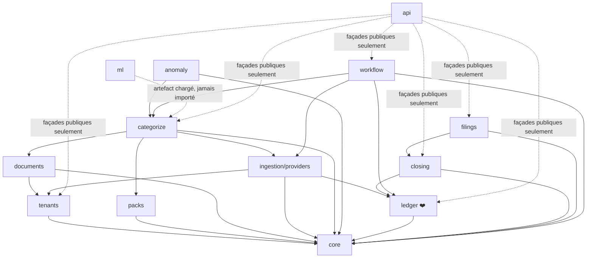

# 18 — Organisation du code

> Statut : arborescence et documentation créées, **aucun code produit** —
> conforme au garde-fou du [README](../README.md) et du [doc 12 §0.1](12-roadmap-todo.md)
> (relecture doc + top départ de Louis encore à venir). Dernière mise à jour : 2026-09-05.

Ce doc fait le lien entre l'arborescence réelle du repo (`backend/`,
`frontend/`) et le découpage en modules défini en [doc 03 §3](03-architecture.md#3--découpage-en-modules-monolithe-modulaire).
Chaque dossier de `backend/axelcompta/*/` a son propre `README.md` avec le
même triptyque : **rôle**, **statut démo (doc 17)** vs **statut V1 (doc 12)**,
**doc de référence**.

## Pourquoi l'arbre complet dès maintenant, alors que seule la démo est visée à court terme

Le module `ledger/` (par exemple) doit être écrit une fois, bien, avec les
bonnes frontières de dépendance — pas retravaillé quand on passera de la
démo à la V1. L'arbre ci-dessous est donc celui **du produit final** ; ce
qui change entre démo et V1, c'est le contenu de chaque dossier, jamais sa
position ni ses règles de dépendance.

## Vue d'ensemble

```text
AxeLCompta/
├── backend/axelcompta/
│   ├── core/                 # actif démo — Money, ids, erreurs
│   ├── tenants/               # réduit démo — 1 dossier en dur (V1 : multi-tenant + matrice statut)
│   ├── packs/                 # actif démo — pack VTC réduit (V1 : taxonomie complète)
│   ├── ingestion/
│   │   └── providers/         # actif démo — DataProvider + chemins A/B/C
│   ├── documents/             # non prévu démo (OCR, justificatifs — V1 seulement)
│   ├── categorize/            # réduit démo — règles + ML, pas de LLM ni revue humaine
│   ├── anomaly/                # non prévu démo (V1 seulement)
│   ├── ledger/                # ❤️ actif démo — moteur pur, golden test doc 17 §7
│   ├── closing/                # réduit démo — clôture minimale
│   ├── filings/                # réduit démo — PDF simplifié (V1 : FEC/EDI/INPI)
│   ├── workflow/                # non prévu démo (revue humaine, signature — V1 seulement)
│   ├── api/                    # réduit démo — pas d'auth (V1 : auth/MFA/permissions)
│   └── ml/                      # non prévu démo — modèle déjà entraîné réutilisé tel quel
├── frontend/                   # réduit démo — rapport HTML/notebook (V1 : Next.js complet)
└── _AUDIT_DONNEES/              # existant, inchangé — source de données pour packs/ et categorize/
```

## Graphe de dépendances (règle vérifiée par import-linter en CI, doc 03 §3)



**Ce que ce graphe interdit, explicitement (doc 03 §3) :**
- `ledger` → `categorize`, `ml`, ou `api` : jamais, dans aucun sens.
- `categorize` → `ledger` directement : passe obligatoirement par `workflow`.
- Tout import direct de `ml` au runtime : les modèles sont des artefacts chargés.

## Ce qui se passe en pratique pour la démo (doc 17)

La coupe verticale de la démo (« faire tourner tout le pipeline bout-en-bout
dès les premiers jours », doc 17 §2) traverse tous les modules « actif » ou
« réduit » du tableau ci-dessus. **Semaine 0 (faite) saute `categorize`** —
il n'entre en jeu qu'en semaine 2, une fois les vrais templates de
ventilation TVA nécessaires :

```
Chemin settlement (Rollee) :
  ingestion/providers → ingestion/reconciliation → ingestion/ecritures_settlement → ledger → closing → filings
   (fixtures golden      (reconcilier() : montant       (ventilation TVA          (512/706+   (compte de   (liasse
    test doc 17 §7)        ±1cts, fenêtre date,           réelle, doc 13 §5.3,      TVA)        résultat +   simplifiée,
                           libellé, doc 13 §4.2)          Uber/Bolt)                            bilan)       reportlab)

Chemin « reste des transactions » (carburant, péage...) — categorize inséré
au lieu d'ecritures_settlement, pas de ventilation TVA :
  ingestion/providers → categorize (règles + ML) → workflow/auto_accept → ledger → closing → filings
```

`tenants`, `packs`, `core` et `api` restent transverses. Les deux chemins
convergent dans le même `ledger` (mémoire pour la démo).

`backend/axelcompta/demo.py` est la composition root qui câble tout ça —
absent du découpage doc 03 §3 exprès : c'est un point d'entrée (comme `api/`),
pas un module d'architecture, donc pas soumis aux mêmes contraintes de
dépendance.

## Statut d'implémentation actuel

**Semaines 0 à 3 du doc 17 faites (2026-09-05)** :
- Semaine 0 : `python -m axelcompta.demo` produit un vrai PDF, en mémoire
  (`InMemoryLedgerService`, pas de DB requise). Postgres + Alembic sont
  montés (`docker-compose.yml`, `migrations/`) et vérifiés contre un vrai
  conteneur (`PostgresLedgerService`, tests d'intégration) mais pas encore
  branchés dans `demo.py`.
- Semaine 1 : les 5 providers rendent des données (plus aucun
  `NotImplementedError`). `FileImportProvider` (chemin C) rejoue le vrai CSV
  audit (36 152 lignes) — testé contre le fichier réel. `DigifactoryProvider`/
  `RolleeProvider` restent chemin B (fixtures) : token 401 et sandbox non
  vérifié toujours d'actualité côté Louis, chemin A non tenté.
- Semaine 2 : `reconcilier()` (doc 13 §4.2, montant ±1cts/fenêtre de
  date/libellé) remplace le bouchon. `construire_ecriture_settlement`
  (doc 13 §5.3) reproduit le golden test Uber exactement et gère le cas
  Bolt (autoliquidation). `RulesAndMlPipeline` (règles du pack + modèle
  `tfidf_logreg_v1.joblib` chargé comme artefact) catégorise le reste des
  transactions ; `workflow/auto_accept.py` les transforme en écriture sans
  revue humaine (stand-in assumé, pas l'architecture cible).
- Semaine 3 : `ClotureSimplifieeService` (`closing/bilan_simplifie.py`)
  remplace le bouchon — compte de résultat + bilan qui s'équilibrent
  réellement (trésorerie = résultat + TVA à payer, vérifié en test).
  `PdfLiasseSimplifieeRenderer` (`filings/liasse_simplifiee.py`) remplace le
  dump brut de comptes par une présentation compte de résultat/bilan/case
  2065 — toujours pas conforme CERFA/DGFiP, écrit noir sur blanc dans le PDF.
- Hors plan initial, demandé explicitement (2026-09-05) : `PdfCerfa2065Renderer`
  (`filings/cerfa_2065.py`) fait un overlay sur le **vrai formulaire
  officiel** 2065-SD (téléchargé depuis impots.gouv.fr, ADR-006 mis à
  jour). Une seule case remplie (résultat fiscal), le reste blanc car hors
  profil démo. Nuance importante : ceci reste de la fidélité visuelle pour
  la relecture humaine, **pas une conformité légale** — le dépôt réel du
  2065 est obligatoirement télétransmis par EDI/EFI (doc 02, statut
  Partenaire EDI), jamais par PDF.
- `backend/axelcompta/demo_dossier_reel.py` (2026-09-05, doc 17 §7bis) :
  composition root sœur de `demo.py`, tourne sur un vrai dossier complet
  (543 transactions réelles, résultat négatif) plutôt qu'un exemple à 2-3
  lignes — a fait remonter un vrai bug de mapping compte-par-catégorie
  (`recettes_plateformes`), corrigé dans `packs/vtc_demo.py`.

Détail et commandes : [backend/README.md](../backend/README.md).

Prochaine étape : semaine 4 du doc 17 (tampon + démo — faire tourner sur
2-3 dossiers, front minimal qui montre les étapes du pipeline).
