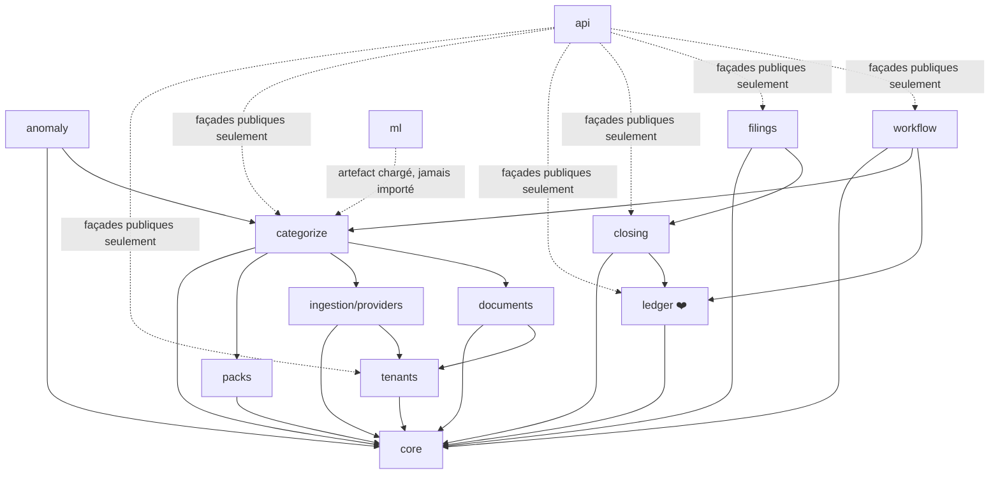

# 18 — Organisation du code

> Statut : arborescence et documentation créées, **aucun code produit** —
> conforme au garde-fou du [README](../README.md) et du [doc 12 §0.1](12-roadmap-todo.md)
> (relecture doc + top départ de Louis encore à venir). Dernière mise à jour : 2026-09-05.

Ce doc fait le lien entre l'arborescence réelle du repo (`backend/`,
`frontend/`) et le découpage en modules défini en [doc 03 §3](03-architecture.md#3--découpage-en-modules-monolithe-modulaire).
Chaque dossier de `backend/axelcompta/*/` a son propre `README.md` avec le
même triptyque : **rôle**, **statut démo (doc 17)** vs **statut V1 (doc 12)**,
**doc de référence**.

## Pourquoi l'arbre complet dès maintenant, alors que seule la démo est visée à court terme

Le module `ledger/` (par exemple) doit être écrit une fois, bien, avec les
bonnes frontières de dépendance — pas retravaillé quand on passera de la
démo à la V1. L'arbre ci-dessous est donc celui **du produit final** ; ce
qui change entre démo et V1, c'est le contenu de chaque dossier, jamais sa
position ni ses règles de dépendance.

## Vue d'ensemble

```text
AxeLCompta/
├── backend/axelcompta/
│   ├── core/                 # actif démo — Money, ids, erreurs
│   ├── tenants/               # réduit démo — 1 dossier en dur (V1 : multi-tenant + matrice statut)
│   ├── packs/                 # actif démo — pack VTC réduit (V1 : taxonomie complète)
│   ├── ingestion/
│   │   └── providers/         # actif démo — DataProvider + chemins A/B/C
│   ├── documents/             # non prévu démo (OCR, justificatifs — V1 seulement)
│   ├── categorize/            # réduit démo — règles + ML, pas de LLM ni revue humaine
│   ├── anomaly/                # non prévu démo (V1 seulement)
│   ├── ledger/                # ❤️ actif démo — moteur pur, golden test doc 17 §7
│   ├── closing/                # réduit démo — clôture minimale
│   ├── filings/                # réduit démo — PDF simplifié (V1 : FEC/EDI/INPI)
│   ├── workflow/                # non prévu démo (revue humaine, signature — V1 seulement)
│   ├── api/                    # réduit démo — pas d'auth (V1 : auth/MFA/permissions)
│   └── ml/                      # non prévu démo — modèle déjà entraîné réutilisé tel quel
├── frontend/                   # réduit démo — rapport HTML/notebook (V1 : Next.js complet)
└── _AUDIT_DONNEES/              # existant, inchangé — source de données pour packs/ et categorize/
```

## Graphe de dépendances (règle vérifiée par import-linter en CI, doc 03 §3)



**Ce que ce graphe interdit, explicitement (doc 03 §3) :**
- `ledger` → `categorize`, `ml`, ou `api` : jamais, dans aucun sens.
- `categorize` → `ledger` directement : passe obligatoirement par `workflow`.
- Tout import direct de `ml` au runtime : les modèles sont des artefacts chargés.

## Ce qui se passe en pratique pour la démo (doc 17)

La coupe verticale de la démo (« faire tourner tout le pipeline bout-en-bout
dès les premiers jours », doc 17 §2) traverse tous les modules « actif » ou
« réduit » du tableau ci-dessus, dans cet ordre :

```
ingestion/providers  →  categorize  →  ledger  →  closing  →  filings
   (chemin A/B/C)      (règles+ML)   (golden      (bilan       (PDF
                                       test §7)     simplifié)  simplifié)
```

`tenants`, `packs`, `core` et `api` sont transverses (consultés à chaque
étape, pas dans le flux séquentiel).

## Statut d'implémentation actuel

Louis a donné le top départ pour un squelette d'interfaces (2026-09-05) :
chaque module actif ou réduit pour la démo a désormais des signatures
(dataclasses, ABC) qui s'importent et passent mypy strict/ruff/import-linter
— voir [backend/README.md](../backend/README.md) pour reproduire les
vérifications. **Rien ne tourne encore** : pas de DB, pas d'appel réseau,
pas de calcul. Prochaine étape : implémenter la semaine 0 du doc 17
(squelette bout-en-bout avec fixtures, jusqu'au PDF « Hello World »).
